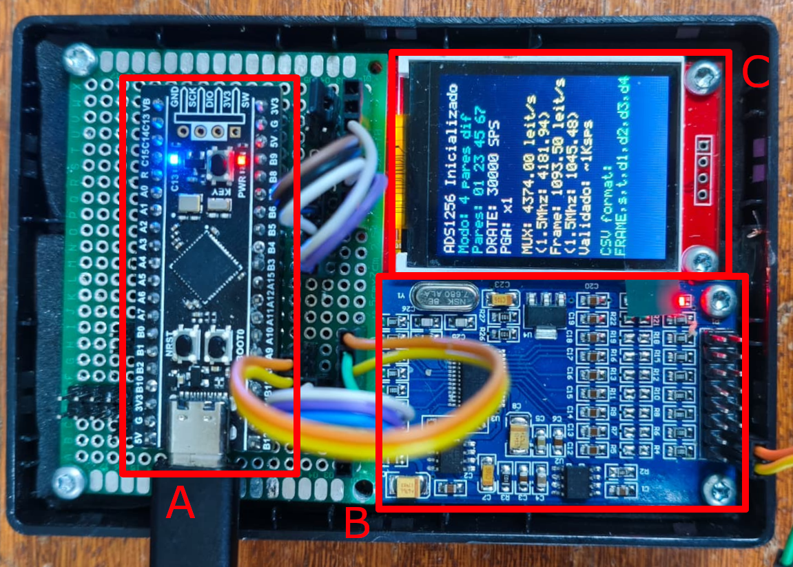

# Dossiê técnico e linha cronológica do sistema de aquisição fisiológica

## STM32F411 Black Pill, ADS1256, ST7735, USB CDC, Raspberry Pi e software de processamento

**Período reconstruído:** 4 de maio a 14 de julho de 2026

**Data desta consolidação:** 14 de julho de 2026, fuso America/Sao_Paulo

**Finalidade:** referência técnica autossuficiente para reprodução, auditoria, redação da monografia e preparação de material didático em vídeo

**Estado do documento:** fotografia auditada do projeto; não é uma certificação médica, metrológica ou de segurança elétrica

---

## 0. Como ler este documento

Este dossiê reúne e reconcilia quatro classes de evidência que, antes desta consolidação, estavam distribuídas entre conversas, repositórios e o texto do TCC:

1. o firmware real da STM32;
2. o software real executado no computador ou na Raspberry Pi;
3. o texto mais recente da monografia e seus resultados experimentais;
4. sete conversas compartilhadas do ChatGPT e duas sessões locais do Codex.

O objetivo não é apenas contar o que se pretendia construir. O objetivo é distinguir claramente:

- o que foi proposto;
- o que chegou a ser implementado;
- o que está presente no código atual;
- o que foi compilado;
- o que foi testado em hardware;
- o que foi medido;
- o que ainda não pode ser reconstruído sem informação adicional.

### 0.1 Convenção de evidência

As seguintes marcações são usadas quando uma distinção é importante:

| Marca | Significado |
|---|---|
| **[CÓDIGO]** | Confirmado no código-fonte atualmente versionado. |
| **[BINÁRIO]** | Confirmado no ELF, BIN, mapa ou outro artefato compilado versionado. |
| **[MEDIDO]** | Confirmado por captura, fotografia, log ou resultado experimental existente. |
| **[HISTÓRICO]** | Relatado em conversa ou commit, mas pode descrever uma versão anterior. |
| **[PROPOSTO]** | Sugerido durante o desenvolvimento, sem comprovação de implementação final. |
| **[INFERÊNCIA]** | Dedução tecnicamente fundamentada a partir das fontes; não foi medida diretamente. |
| **[DESCONHECIDO]** | A informação necessária não está registrada nas fontes auditadas. |

### 0.2 Hierarquia usada para resolver contradições

Quando duas fontes divergem, foi adotada a seguinte precedência:

1. código-fonte e configuração do commit atual;
2. artefato compilado e captura experimental pertencentes ao mesmo commit;
3. histórico Git;
4. texto mais recente do TCC;
5. relatos de conversas;
6. propostas ou exemplos gerados durante as conversas.

Essa regra é essencial porque os chats registram vários estados transitórios: aquisição de um único canal contra AINCOM, DRATE de 1 kSPS, pinos PB0/PB1, buffer USB de 2.048, 4.096 ou 8.192 bytes e intenção de usar a Flash SPI externa. Nenhuma dessas configurações deve ser confundida automaticamente com a versão atual.

### 0.3 Fotografias criptográficas do estado auditado

| Artefato | Estado auditado |
|---|---|
| Repositório do TCC | commit <code>3609c18</code>, 14/07/2026 09:27:24 −03 |
| Fonte principal do TCC | <code>fcte_template.tex</code>, SHA-256 <code>f8e2055f1e5926cc6741d4a659f40052343b93edd68ea814227bf146ec0ae4c4</code> |
| PDF do TCC | 158 páginas, SHA-256 <code>d4962096597c1e772e1186c9ae4811995586156f25f6b30a782a885e78b1b1f5</code> |
| Repositório do firmware | commit <code>7fc7d6d724f3d762ea08447b26180b6c7ec7d27a</code>, 08/07/2026 16:48:27 −03 |
| BIN do firmware | 39.256 bytes, SHA-256 <code>f7334208b5126c9154046320ddf6dbfae54d35ca2d6065788b25f7c6ca834a0f</code> |
| ELF do firmware | 936.740 bytes com símbolos de depuração, SHA-256 <code>395d8c6310eb8aa2a59c90f1acd6f0b60156129f2986c85481aef5c2d4bcd90b</code> |
| Captura serial mais recente | 100.005 frames, SHA-256 <code>7ff5345e2a67fa8f2ce1af0cae6318e1f1b634bc392aead25e21e0351a5647b9</code> |
| Validador serial | <code>grava_serial_csv.py</code>, SHA-256 <code>f631fed79bbb39fb4db2e1e4ea7dcd837d6aeeb4f7b46655e8973802e48b73d4</code> |
| Software Raspberry/PC | commit <code>d34b56bec961cbea028f5cc8573e845f4e215c63</code>, 07/07/2026 07:47:53 −03 |

Os três repositórios estavam sem alterações locais no instante da auditoria.

### 0.4 Localização das fontes

| Conteúdo | Caminho local auditado | Repositório remoto |
|---|---|---|
| TCC | <code>/home/davi/repos/TCC</code> | repositório local importado do Overleaf |
| Firmware | <code>/home/davi/repos/blackpill_ads1256+display</code> | <https://github.com/Tyrion1606/blackpill_ads1256-display> |
| Aplicação Raspberry/PC | <code>/home/davi/repos/processamento_biomedico</code> | <https://github.com/AlexAndrei3663/processamento_biomedico> |

---

# Parte I — Estado atual em uma leitura

## 1. O que o sistema atual é

O sistema é uma plataforma acadêmica de aquisição multicanal organizada em duas camadas físicas:

1. **núcleo determinante da aquisição:** módulos de condicionamento, ADS1256, STM32F411 e display auxiliar;
2. **camada de processamento:** Raspberry Pi 3 B+, tela de 7 polegadas, aplicação Python e armazenamento HDF5.

O fluxo lógico atualmente pretendido é:

~~~mermaid
flowchart LR
    S1[AD8232 número 1] --> A0[AIN0 menos AIN1]
    S2[AD8232 número 2] --> A1[AIN2 menos AIN3]
    S3[Pulse Sensor Amped] --> A2[AIN4 menos AIN5]
    S4[Canal auxiliar] --> A3[AIN6 menos AIN7]
    A0 --> ADC[ADS1256 24 bits, PGA 1, DRATE 30 kSPS]
    A1 --> ADC
    A2 --> ADC
    A3 --> ADC
    ADC -->|SPI2, modo 1, 1,5 MHz| MCU[STM32F411CEU6 96 MHz]
    MCU -->|SPI3, modo 0, 24 MHz| TFT[ST7735 diagnóstico]
    MCU -->|USB CDC FRAME CSV| PI[Raspberry Pi ou PC]
    PI --> PARSER[Leitor serial e parser]
    PARSER --> LIVE[Memória circular visualização]
    PARSER --> REC[Fila de gravação]
    REC --> H5[HDF5 com dados brutos]
    LIVE --> PROC[Conversão, filtros, métricas e FFT]
    PROC --> GUI[PyQt5 e PyQtGraph]
~~~

### 1.1 Resumo de configuração

| Subsistema | Configuração confirmada |
|---|---|
| Microcontrolador | STM32F411CEU6 em placa WeAct Black Pill |
| Clock externo da Black Pill | HSE de 25 MHz |
| Clock do núcleo | 96 MHz |
| Clock USB | 48 MHz |
| Conversor | ADS1256, palavra de 24 bits em complemento de dois |
| Clock do ADS1256 | módulo tratado como 7,68 MHz |
| DRATE | registrador <code>0xF0</code>, taxa nominal de saída de dados de 30 kSPS do filtro digital, escalada com (f_{\mathrm{CLKIN}}) |
| PGA | 1 |
| Buffer analógico interno | não habilitado pelo firmware; permanece no estado de reset, desabilitado |
| Modo de entrada | quatro pares diferenciais: <code>0x01</code>, <code>0x23</code>, <code>0x45</code>, <code>0x67</code> |
| SPI do ADC | SPI2, mestre, 8 bits, MSB primeiro, CPOL 0, CPHA segunda borda, 1,5 MHz |
| Display | ST7735, 128 × 160, RGB565, SPI3 modo 0 a 24 MHz |
| Transporte | USB Full Speed, classe CDC, linhas CSV terminadas em CRLF |
| Taxa útil medida | aproximadamente 1.000 frames/s |
| Amostras por frame | 4, uma por par diferencial |
| Taxa útil por par | aproximadamente 1.000 amostras/s |
| Conversões úteis transmitidas | aproximadamente 4.000 valores/s |
| Timestamp atual | microssegundos desde a inicialização do DWT, transmitido como <code>uint32_t</code> |
| Sequência atual | <code>uint32_t</code>, incrementada uma vez por frame |
| Unidade de processamento | Raspberry Pi 3 Model B+ ou computador Linux/Windows |
| Armazenamento principal | HDF5 extensível, com contagens brutas preservadas |

## 2. Vocabulário de taxas: a distinção que evita o principal erro de interpretação

Quatro grandezas diferentes aparecem no histórico. Elas não são intercambiáveis.

| Grandeza | Símbolo adotado neste documento | Valor atual ou referência |
|---|---:|---:|
| Taxa configurada no registrador DRATE do ADS1256 | \(f_{\mathrm{DRATE}}\) | 30.000 SPS |
| Throughput total de leituras ao ciclar o MUX, tabela TI a SCLK 1,92 MHz | \(f_{\mathrm{MUX,TI}}\) | 4.374 leituras/s |
| Estimativa de leituras com SCLK real de 1,5 MHz | \(f_{\mathrm{MUX,est}}\) | 4.181,94 leituras/s |
| Taxa experimental de frames completos | \(f_{\mathrm{frame}}\) | cerca de 1.000 frames/s |
| Taxa experimental de cada par diferencial | \(f_{\mathrm{canal}}\) | cerca de 1.000 amostras/s por par |
| Quantidade total de valores úteis transmitidos | \(f_{\mathrm{valores}}\) | cerca de 4.000 valores/s |

DRATE não é a frequência do modulador. Com o clock nominal do ADS1256 em 7,68 MHz, o modulador opera a (f_{\mathrm{CLKIN}}/4\), aproximadamente 1,92 MHz; o código <code>0xF0</code> seleciona a taxa de saída do filtro digital de 30 kSPS.

Com quatro pares, a relação idealizada é:

\[
f_{\mathrm{frame}} =
\frac{f_{\mathrm{MUX}}}{N_{\mathrm{pares}}},
\qquad
N_{\mathrm{pares}} = 4.
\]

Assim:

\[
\frac{4.374}{4} = 1.093{,}5\ \text{frames/s}
\]

para a condição tabelada pela Texas Instruments, e:

\[
\frac{4.181{,}94}{4} = 1.045{,}485\ \text{frames/s}
\]

para a estimativa simplificada a 1,5 MHz.

O resultado real do sistema completo foi:

\[
f_{\mathrm{frame,MCU}} =
\frac{100.005 - 1}{120{,}342831 - 20{,}341099}
= 1.000{,}022680\ \text{frames/s}.
\]

Portanto, a formulação correta é:

> O ADS1256 está configurado com DRATE de 30 kSPS. Ao ciclar sequencialmente quatro pares diferenciais e incluir comandos SPI, atrasos, formatação e transmissão USB, o sistema entrega experimentalmente cerca de 1 kSPS por par, isto é, aproximadamente 1.000 frames multicanais/s e 4.000 valores de ADC/s.

Não é correto escrever que o ADS1256 está configurado em 1 kSPS na versão atual. Também não é correto somar os quatro canais e declarar 30 kSPS úteis.

## 3. O que um frame representa — e o que ele não representa

O frame transmitido tem o formato:

~~~text
FRAME,<sequence_id>,<timestamp_us>,<d1>,<d2>,<d3>,<d4>\r\n
~~~

O mapeamento é fixo:

| Campo | Par do ADS1256 | Uso documentado nos ensaios fisiológicos |
|---|---|---|
| <code>d1</code> | AIN0 − AIN1 | ECG 1 |
| <code>d2</code> | AIN2 − AIN3 | ECG 2 |
| <code>d3</code> | AIN4 − AIN5 | PPG |
| <code>d4</code> | AIN6 − AIN7 | canal auxiliar; descrito de modo inconsistente como livre ou temperatura |

Os quatro valores pertencem ao mesmo **ciclo lógico de varredura**, mas não ao mesmo instante físico. Existe apenas um modulador/conversor no ADS1256; o MUX é chaveado sequencialmente. Dividir a vazão média de 4.000 leituras/s sugere 250 µs por leitura útil e cerca de 750 µs entre a primeira e a quarta; usar a estimativa de 4.181,94 leituras/s produz 239,12 µs e 717,37 µs. Esses números são apenas médias de throughput sob hipótese de espaçamento uniforme, não defasagens medidas. A fronteira entre frames inclui formatação/USB e o canal zero pode permanecer em conversão antes do readout; a defasagem real por canal precisa ser medida com GPIO e osciloscópio ou analisador lógico.

Consequências:

- “multicanal” é correto;
- “quatro canais no mesmo frame” é correto;
- “base temporal comum de frame” é correto;
- “amostragem simultânea” só pode ser usada no sentido operacional amplo;
- “conversões fisicamente simultâneas” é incorreto.

O timestamp atual é obtido **imediatamente antes da chamada** que lê os quatro valores e funciona como marcador do limite de iteração no software. Em regime permanente, porém, a conversão de <code>d1</code> já foi iniciada ao fim da chamada anterior e pode até ter terminado durante a formatação e o envio USB. Logo, o timestamp não é o início físico do frame nem o instante da primeira conversão; não existe timestamp individual de canal.

## 4. Limite de validade e segurança

O conjunto é um protótipo acadêmico. Não existe, nas fontes auditadas, evidência de:

- certificação de segurança elétrica;
- isolamento médico entre pessoa, USB, Raspberry Pi e rede elétrica;
- conformidade com normas de eletrocardiografia;
- aprovação clínica ou regulatória;
- calibração metrológica rastreável;
- proteção completa das entradas contra ESD, sobretensão ou desfibrilação;
- validação diagnóstica.

Uma reprodução para testes com sinais de bancada é diferente de uma reprodução conectada a uma pessoa. Antes de conectar eletrodos a um voluntário, a alimentação, o isolamento, os limites de corrente, os módulos utilizados e o protocolo de pesquisa precisam ser avaliados formalmente. O fato de a Raspberry Pi ser alimentada por bateria em algumas montagens não prova isolamento se HDMI, USB, carregadores, osciloscópio ou outro equipamento aterrado permanecer conectado.

---

# Parte II — Linha cronológica consolidada

## 5. Fontes cronológicas e deduplicação

As datas abaixo são os horários originais das mensagens e commits, convertidos para America/Sao_Paulo. Os dois primeiros chats compartilhados contêm o mesmo tronco de 222 mensagens até 08/05/2026 02:30:17 e só então bifurcam. Esse tronco aparece uma única vez nesta cronologia.

| Fonte de conversa | Intervalo reconstruído | Observação |
|---|---|---|
| Branch · Software para programar Bluepill | 04/05/2026 17:01:19 → 08/05/2026 02:35:29 | compartilha o tronco inicial |
| kSPS por canal | 04/05/2026 17:01:19 → 14/07/2026 10:05:47 | compartilha o tronco inicial e continua |
| Raspberry Pi sem interface | 30/06/2026 16:59:29 → 14/07/2026 10:17:39 | implantação embarcada |
| Bootloader STM32F411CEU6 | 30/06/2026 21:03:50 → 21:31:58 | reconstrução do comando de gravação |
| Explicação ENOB ADS1256 | 02/07/2026 17:16:39 → 17:17:49 | contém um erro de fator 2 corrigido neste dossiê |
| Importação de funções C | 08/05/2026 04:35:06 → 11:06:27 | modularização |
| Modos SPI no CubeMX | 08/05/2026 01:04:52 → 01:30:27 | discussão conceitual |
| Codex: Investigar taxa de aquisição | 02/07/2026 19:59 → 21:11 | diagnóstico e correção do pipeline |
| Codex: Usar microssegundos no timestamp | 08/07/2026 16:31 → 17:19 | timestamp DWT e validação |

## 6. 4 de maio de 2026 — escolha do ecossistema

### 6.1 17:01–17:12 — PlatformIO como ponto de partida

O desenvolvimento começou pela escolha de uma forma de programar a WeAct Black Pill com STM32F411CEU6. Foram comparados Arduino, STM32Cube/HAL, CMSIS, libopencm3, Zephyr, STM32CubeProgrammer, ST-Link e gravação por USB.

O primeiro ambiente escolhido foi PlatformIO:

~~~ini
[env:blackpill_f411ce]
platform = ststm32
board = blackpill_f411ce
framework = stm32cube
upload_protocol = dfu
~~~

Esse passo foi importante para estabelecer que:

- o firmware seria escrito em C;
- HAL seria a camada principal de abstração;
- CMSIS forneceria acesso ao núcleo ARM e aos registradores;
- o STM32 poderia ser gravado sem ST-Link usando o DFU interno.

O projeto definitivo migrou depois para STM32CubeMX e STM32CubeIDE. Portanto, o arquivo PlatformIO acima é registro histórico, não a receita de compilação atual.

## 7. 5 de maio de 2026 — primeira gravação, perda do HID e recuperação

### 7.1 16:49–17:08 — Python e PlatformIO no Linux

O PlatformIO não encontrava um ambiente Python utilizável apesar de <code>/usr/bin/python3</code> existir. A preparação discutida foi:

~~~bash
sudo apt install python3-venv python3-pip python-is-python3
~~~

Nesse momento foram diferenciados o interpretador <code>python3</code>, o módulo de ambientes virtuais e o instalador <code>pip</code>.

### 7.2 17:39–17:59 — entrada no DFU interno

O primeiro upload reconheceu o dispositivo ST em <code>0483:df11</code>, mas falhou com <code>LIBUSB_ERROR_ACCESS</code>. Foram testadas regras udev; a forma registrada como funcional foi:

~~~udev
SUBSYSTEM=="usb", ATTR{idVendor}=="0483", ATTR{idProduct}=="df11", MODE:="0666", TAG+="uaccess"
~~~

A sequência física confirmada foi:

1. manter a placa conectada ao USB;
2. segurar BOOT0;
3. pressionar e soltar NRST;
4. aguardar aproximadamente um segundo;
5. soltar BOOT0.

O aplicativo de teste foi gravado em <code>0x08000000</code>. Isso sobrescreveu o bootloader HID da WeAct que ocupava o início da Flash interna.

### 7.3 18:02–18:56 — LED PC13 e SysTick

O firmware mínimo deveria piscar o LED em PC13, ativo em nível baixo:

~~~c
HAL_GPIO_WritePin(GPIOC, GPIO_PIN_13, GPIO_PIN_RESET); /* aceso */
HAL_GPIO_WritePin(GPIOC, GPIO_PIN_13, GPIO_PIN_SET);   /* apagado */
~~~

Após sintomas de ausência de execução e desaparecimento do dispositivo USB em modo normal, foi acrescentado ao projeto mínimo:

~~~c
void SysTick_Handler(void)
{
    HAL_IncTick();
}
~~~

O usuário confirmou o LED piscando. O teste validou compilação, gravação, execução, polaridade do LED e funcionamento do atraso naquele projeto mínimo. Não se deve generalizar que todo projeto CubeMX precisaria acrescentar manualmente esse handler; normalmente ele existe nos arquivos de interrupção gerados.

### 7.4 18:58–23:20 — restauração do WeAct HID Bootloader

Foi localizado o bootloader oficial da WeAct para a placa com cristal de 25 MHz:

<https://github.com/WeActStudio/WeActStudio.MiniSTM32F4x1/tree/master/Soft/WeAct_HID_FW_Bootloader>

O arquivo apropriado discutido foi <code>WeAct_HID_Bootloader_F4x1.hex</code>, e não a variante para cristal de 8 MHz.

O histórico não preservou o commit nem o SHA-256 do HEX e do <code>WeAct_HID_Flash-CLI</code> usados. O caminho <code>master</code> pode mudar; uma reprodução futura deve fixar o commit da WeAct e arquivar hashes dos dois artefatos.

Dois mecanismos de boot passaram a coexistir:

| Mecanismo | VID:PID | Local | Entrada |
|---|---|---|---|
| ST DFU | <code>0483:df11</code> | ROM/System Memory | BOOT0 + reset |
| WeAct HID | <code>0483:572a</code> | primeiros 16 KiB da Flash | KEY + reset |

O mapa adotado tornou-se:

~~~text
0x08000000 ┌──────────────────────────────────────────────┐
           │ WeAct HID Bootloader, 16 KiB                │
0x08004000 ├──────────────────────────────────────────────┤
           │ Aplicação, 496 KiB                          │
0x08080000 └──────────────────────────────────────────────┘

0x20000000 ┌──────────────────────────────────────────────┐
           │ SRAM, 128 KiB                               │
0x20020000 └──────────────────────────────────────────────┘
~~~

Três ajustes precisam concordar:

1. o linker deve colocar a aplicação em <code>0x08004000</code>;
2. <code>SCB->VTOR</code> deve apontar para <code>0x08004000</code>;
3. o binário deve ser fisicamente gravado como aplicativo pelo bootloader.

Um binário antigo foi examinado e começou com SP <code>0x20020000</code> e vetor de reset <code>0x080005E9</code>. Isso provou que ele ainda estava linkado para o setor zero. Gravar esse mesmo binário em <code>0x08004000</code> não corrigiria seus endereços internos.

O binário atual foi posteriormente confirmado com:

~~~text
primeira palavra:  0x20020000
segunda palavra:   0x080058DD
Reset_Handler:     0x080058DC, desprezando o bit Thumb
seção .isr_vector: VMA 0x08004000
~~~

### 7.5 Flash externa da Black Pill — ideia que não integrou a versão atual

Foi discutida uma memória SPI externa anunciada como “8M”, provavelmente da família W25Qxx. Também foram citados os comandos JEDEC ID <code>0x9F</code>, leitura <code>0x03</code>, page program <code>0x02</code> e sector erase <code>0x20</code>.

Chegou a ser proposto um registro de 16 bytes com magic, sequência, timestamp em milissegundos e valor bruto. Porém:

- não foi encontrado teste de JEDEC ID;
- a capacidade real não foi confirmada;
- o logger não está no firmware atual;
- a Flash externa não deve ser descrita como armazenamento implementado.

Ao final do dia, o foco mudou para ADS1256, USB CDC, display e armazenamento na Raspberry Pi.

## 8. 6 de maio de 2026 — primeiro ADS1256 e projeto CubeMX

### 8.1 Separação inicial de barramentos

Foi proposta a separação:

~~~text
SPI1 → Flash externa
SPI2 → ADS1256
~~~

O raciocínio era evitar reconfiguração entre modos SPI, disputa no MISO e interferência de operações de erase/program sobre a aquisição. DMA foi estudado conceitualmente, mas adiado até o funcionamento por polling.

### 8.2 Módulo ADS1256 e primeira pinagem

O hardware disponível era um módulo ADS1256 com <code>5V</code>, <code>GND</code>, <code>SCLK</code>, <code>DIN</code>, <code>DOUT</code>, <code>CS</code>, <code>DRDY</code>, <code>PDWN</code> e <code>AIN0...AIN7</code>. Como não havia pino RESET exposto, foi adotado o comando SPI <code>0xFE</code>.

A primeira pinagem foi:

| STM32 histórico | ADS1256 |
|---|---|
| PB12 | CS |
| PB13 | SCLK |
| PB14 | DOUT/MISO |
| PB15 | DIN/MOSI |
| PB1 | DRDY |
| PB0 | PDWN |

PB0/PB1 foram substituídos em 13 de maio por PA9/PA8.

### 8.3 Primeira configuração ADS1256 + USB

Os parâmetros discutidos já continham grande parte do clock atual:

- HSE 25 MHz;
- PLLM 25;
- PLLN 192;
- PLLP 2;
- PLLQ 4;
- núcleo 96 MHz;
- USB 48 MHz;
- SPI2 modo 1;
- prescaler 32, resultando em 1,5 MHz.

Foram introduzidos os principais comandos e registradores:

| Tipo | Nome | Código |
|---|---|---:|
| comando | WAKEUP | <code>0x00</code> |
| comando | RDATA | <code>0x01</code> |
| comando | RDATAC | <code>0x03</code> |
| comando | SDATAC | <code>0x0F</code> |
| comando | RREG | <code>0x10</code> |
| comando | WREG | <code>0x50</code> |
| comando | SELFCAL | <code>0xF0</code> |
| comando | SYNC | <code>0xFC</code> |
| comando | STANDBY | <code>0xFD</code> |
| comando | RESET | <code>0xFE</code> |
| registrador | STATUS | <code>0x00</code> |
| registrador | MUX | <code>0x01</code> |
| registrador | ADCON | <code>0x02</code> |
| registrador | DRATE | <code>0x03</code> |

No histórico apareceram DRATE 30 kSPS, 15 kSPS e, no primeiro snapshot modular integrado, 1 kSPS. O código atual voltou a 30 kSPS.

### 8.4 Migração para STM32CubeMX e STM32CubeIDE

Um projeto CubeIDE criado de forma inadequada não encontrava <code>stm32f4xx_hal.h</code>. A solução foi gerar a base no CubeMX:

1. MCU Selector;
2. STM32F411CEUx;
3. Toolchain/IDE igual a STM32CubeIDE;
4. opção <code>Generate under root</code> habilitada.

Também foi corrigido um SCK que o CubeMX havia inicialmente colocado em PB10; o barramento final usa PB13.

### 8.5 Primeiros testes de vazão — exploratórios

Foram usados comandos como:

~~~bash
cat /dev/ttyACM1
screen /dev/ttyACM1 115200
cat /dev/ttyACM1 | pv -brt > /dev/null
cat /dev/ttyACM1 | pv -l -r > /dev/null
~~~

Foram observados cerca de 177 KiB/s e 27,9 mil linhas/s em uma fase com buffer textual. Esses números não constituem validação da taxa do ADC porque o texto tinha comprimento variável, havia logs misturados, não existia timestamp de alta resolução e <code>pv</code> mede recepção no host. A explicação dada na conversa de que CRLF seria contado como duas linhas por <code>pv -l</code> também não deve ser usada como fato.

Essas medições foram substituídas pelo validador Python e pelas capturas versionadas de julho.

## 9. 7 de maio de 2026 — divisão entre aquisição e interface

Foi avaliada a ideia de gerar HDMI diretamente no STM32F411. Ela foi abandonada porque esse microcontrolador não possui LTDC, PHY TMDS, controlador HDMI nem RAM adequada para um framebuffer gráfico convencional.

Essa decisão consolidou uma separação que permaneceu no projeto:

~~~text
STM32F411 → aquisição, temporização e transporte
ST7735    → diagnóstico local simples
Raspberry → interface HDMI/touch, processamento e armazenamento
~~~

## 10. 8 de maio de 2026 — display, bootloader e modularização

### 10.1 Funcionamento do botão KEY no bootloader WeAct

Uma análise relatada no chat, aparentemente baseada em leitura ou engenharia reversa do bootloader, indicou que:

- KEY está em PA0;
- usa pull-up;
- é ativo em nível baixo;
- é consultado por polling, não por EXTI;
- enquanto pressionado no início, o LED C13 alterna aproximadamente a cada 60 ms;
- uma pressão longa no loop pode desinicializar USB/HAL e saltar para <code>0x1FFF0000</code>, System Memory.

O botão não troca fisicamente um bootloader por outro; ele altera o caminho de execução.

Os detalhes de pull-up, polling, período de aproximadamente 60 ms e salto para System Memory não aparecem integralmente no README público consultado. Devem ser tratados como **[HISTÓRICO]** até que o fonte ou binário exato analisado seja arquivado com commit e SHA-256.

### 10.2 ST7735S em SPI3

Foi adotado um display de 1,8 polegada, 128 × 160, RGB565:

| STM32 | ST7735 |
|---|---|
| PB3 | SCK |
| PB5 | MOSI |
| PB4 | CS |
| PB6 | DC/A0 |
| PB7 | RST |
| 3V3 | alimentação e backlight, conforme o módulo |
| GND | terra |

PB3/PB4 conflitam com funções JTAG. A configuração indicada foi manter apenas <code>Serial Wire</code>, preservando PA13/PA14 para SWD e liberando PB3/PB4.

O chat separado “Modos SPI no CubeMX” registrou a escolha conceitual para o display:

- mestre;
- transmissão simples ou full duplex sem uso do MISO;
- Motorola;
- 8 bits;
- MSB primeiro;
- modo 0;
- NSS por software;
- CS manual;
- polling antes de DMA.

O código atual usa SPI3 modo 0, divisor 2 sobre PCLK1 de 48 MHz, isto é, 24 MHz.

### 10.3 Primeiras tentativas de gravação HID

A sequência operacional tornou-se:

1. segurar KEY;
2. pressionar RESET;
3. aguardar o LED indicar o bootloader;
4. confirmar <code>0483:572a</code> no <code>lsusb</code>;
5. gravar um BIN corretamente linkado para <code>0x08004000</code>.

Uma primeira execução do CLI sofreu segmentation fault ao enviar o comando de reset de páginas. O histórico posterior do terminal comprovou uso bem-sucedido, com privilégio elevado:

~~~bash
cd ~/Downloads/WeActStudio.MiniSTM32F4x1/Soft/WeAct_HID_FW_Bootloader

sudo ./WeAct_HID_Flash-CLI \
  ~/repos/blackpill_ads1256+display/Debug/blackpill_ads1256+display.bin
~~~

### 10.4 04:35–04:55 — modularização

O firmware monolítico foi reorganizado. Uma primeira proposta usava abreviações; após solicitação explícita por nomes descritivos, a arquitetura passou a usar:

~~~text
Core/Inc/adc_ads1256.h
Core/Src/adc_ads1256.c
Core/Inc/display_st7735.h
Core/Src/display_st7735.c
Core/Inc/usb_cdc_serial.h
Core/Src/usb_cdc_serial.c
Core/Inc/microsecond_delay.h
Core/Src/microsecond_delay.c
Core/Inc/application_config.h
Core/Inc/application_error.h
Core/Src/application_error.c
Core/Src/main.c
~~~

Os arquivos ZIP gerados nas conversas foram etapas intermediárias. O repositório Git atual é a fonte de verdade.

### 10.5 Primeiros commits do firmware

| Horário | Commit | Conteúdo |
|---|---|---|
| 08/05 04:27:05 | <code>92f1c28</code> | primeira base CubeMX |
| 08/05 05:21:33 | <code>0cc2151</code> | arquitetura modular |
| 08/05 12:50:42 | <code>57a10fe</code> | ADC, display e serial integrados; baixa taxa atribuída à escrita do display |

O snapshot revisado na manhã de 8 de maio ainda usava:

- AIN0 − AINCOM;
- DRATE 1.000 SPS;
- PGA 1;
- DRDY em PB1;
- PDWN em PB0;
- envio USB com buffer.

Ele não descreve a versão final de quatro pares.

### 10.6 Faixa e resolução do ADS1256

Foi identificada a escrita <code>ADCON = 0x00</code>, correspondente a clock out desligado, sensor detect desligado e PGA 1.

A relação correta para o ADS1256 é:

\[
V_{\mathrm{diff,extremo}} =
\pm\frac{2V_{\mathrm{REF}}}{G}
\]

e o span total é:

\[
V_{\mathrm{span}} =
\frac{4V_{\mathrm{REF}}}{G}.
\]

Para \(V_{\mathrm{REF}}=2{,}5\ \mathrm{V}\) e \(G=1\):

~~~text
extremo negativo: −5 V diferenciais
extremo positivo: +5 V diferenciais
span total:        10 V
códigos:           −8.388.608 a +8.388.607
LSB ideal:         aproximadamente 0,596 µV
~~~

Essa faixa diferencial não autoriza aplicar −5 V físicos a um pino referido ao GND. Cada entrada analógica precisa permanecer dentro dos limites absolutos e de modo comum definidos pelo datasheet e por AVDD/AGND do ADS1256. O CI não possui pino AVSS; se a placa expuser um rail analógico negativo externo com esse rótulo, ele precisa ser identificado separadamente no esquema do módulo.

## 11. 11–13 de maio de 2026 — pinos PA8/PA9 e falha do SPI

### 11.1 Mudança dos sinais de controle

Em 11 de maio foi discutida a migração de PB0/PB1 para PA8/PA9. A recomendação verbal inicial inverteu os papéis, mas o código que prevaleceu e a montagem atual usam:

| Função atual | Pino |
|---|---|
| ADS_DRDY | PA8, entrada com pull-up |
| ADS_PDWN | PA9, saída |

Os commits correspondentes foram:

| Data | Commit | Efeito |
|---|---|---|
| 13/05 22:19:18 | <code>6ac0468</code> | migração de PB0/PB1 para PA9/PA8 |
| 13/05 22:43:39 | <code>4d5d6d8</code> | correção posterior do prescaler SPI2 |

### 11.2 Texto 5 × 7 e diagnóstico do MUX

Foi adicionada uma fonte ASCII 5 × 7 ao ST7735. Um valor numérico do MUX havia sido convertido incorretamente para <code>char</code> quando a função esperava <code>const char *</code>. A solução foi formatar o valor:

~~~c
char displayMuxMessage[24];

snprintf(displayMuxMessage,
         sizeof(displayMuxMessage),
         "MUX: 0x%02X",
         muxRegisterValueReadBack);
~~~

### 11.3 MUX 0x00, timeout de DRDY e causa confirmada

Após a regeneração do projeto e mudança dos pinos, o ADS1256 retornou MUX <code>0x00</code> e depois ocorreu timeout em DRDY. A causa confirmada pelo usuário foi:

~~~text
SPI_BAUDRATEPRESCALER_2
~~~

Com PCLK1 de 48 MHz:

\[
f_{\mathrm{SPI2,incorreto}} =
\frac{48\ \mathrm{MHz}}{2}
= 24\ \mathrm{MHz}.
\]

Para o ADS1256 com clock de 7,68 MHz, o período mínimo de SCLK equivale a quatro períodos de CLKIN:

\[
f_{\mathrm{SCLK,max}} =
\frac{7{,}68\ \mathrm{MHz}}{4}
= 1{,}92\ \mathrm{MHz}.
\]

A correção foi:

\[
f_{\mathrm{SPI2,atual}} =
\frac{48\ \mathrm{MHz}}{32}
= 1{,}5\ \mathrm{MHz}.
\]

Prescaler 16 produziria 3 MHz e também excederia o limite.

Sintomas compatíveis com SCLK excessivo incluem RESET não reconhecido, leituras <code>0x00</code> ou <code>0xFF</code>, WREG/RREG corrompidos, DRATE incorreto e DRDY aparentemente travado.

**Risco atual de regressão:** <code>Core/Src/spi.c</code> contém corretamente divisor 32, mas <code>blackpill_ads1256+display.ioc</code> ainda contém divisor 2. Regenerar o projeto pelo CubeMX sem corrigir antes o arquivo <code>.ioc</code> pode restaurar 24 MHz e interromper novamente a comunicação.

### 11.4 Escolha dos quatro pares e throughput

O formato do registrador MUX foi consolidado:

~~~text
nibble alto → entrada positiva
nibble baixo → entrada negativa

0x01 → AIN0 − AIN1
0x23 → AIN2 − AIN3
0x45 → AIN4 − AIN5
0x67 → AIN6 − AIN7
~~~

A tabela de cycling do datasheet mostrou que DRATE de 30 kSPS era necessário para chegar próximo de 1 kSPS por par ao varrer quatro pares. Essa decisão guiou a versão de julho.

## 12. 13–14 de maio de 2026 — primeira arquitetura da aplicação Python

O repositório <code>processamento_biomedico</code> começou em 13 de maio e evoluiu rapidamente por etapas:

| Data | Commit | Marco |
|---|---|---|
| 13/05 16:54 | <code>c2d8838</code> | criação do projeto |
| 13/05 17:09 | <code>b91a49d</code> | recursos de depuração |
| 13/05 23:23 | <code>d3c1ef9</code> | sessão, protocolo e buffers multicanais |
| 13/05 23:44 | <code>cdf5366</code> | abas de visualização ao vivo |
| 14/05 00:11 | <code>ff65984</code> | navegação por páginas |
| 14/05 00:32 | <code>4d95f75</code> | filtros e pipeline |
| 14/05 00:58 | <code>bd4b994</code> | espectro |
| 14/05 01:32 | <code>5dbb9c0</code> | armazenamento de sessões |
| 14/05 01:51 | <code>932b9c8</code> | exportação, presets e robustez |
| 14/05 02:14 | <code>b19fcdf</code> | preparação para Raspberry Pi |

Desde cedo, a intenção arquitetural foi separar a janela visual da gravação integral, para que reduzir a quantidade de pontos desenhados não descartasse dados da sessão.

## 13. 26 de maio e 21 de junho de 2026 — amadurecimento da interface

Em 26 de maio, o commit <code>66cd16e</code> ajustou referências de alinhamento da tela inicial. Em 21 de junho, <code>b91e9ab</code> realizou uma revisão ampla do software.

Esse último commit foi também a versão que apareceu no log de atualização da Raspberry Pi durante a implantação de 30 de junho:

~~~text
HEAD is now at b91e9ab FEAT: Revisão total do código
~~~

## 14. 30 de junho de 2026 — Raspberry Pi como equipamento dedicado

### 14.1 Preparação do sistema

Foi escolhida uma Raspberry Pi 3 Model B+ com cartão microSD de 64 GB e a imagem:

~~~text
2026-06-18-raspios-trixie-armhf-lite.img.xz
~~~

Identidade registrada:

~~~text
usuário:  admin
hostname: pip
~~~

O hostname <code>pip</code> foi inicialmente confundido com o usuário; <code>whoami</code> confirmou <code>admin</code>.

A estrutura de implantação proposta foi:

~~~text
/opt/processamento_biomedico   repositório
/opt/biomedico/venv            ambiente Python
/opt/biomedico/data            sessões
/opt/biomedico/logs            logs
/opt/biomedico/update_repo.sh  atualização
/opt/biomedico/run_app.sh      execução
~~~

O atualizador verificava conectividade com <code>git ls-remote</code>, fazia clone ou <code>git fetch --prune</code> seguido de <code>git reset --hard origin/main</code> e mantinha a cópia local se a internet falhasse. Esse comportamento “fail-open” foi escolhido para que a ausência de rede não impedisse o uso do equipamento.

### 14.2 Tentativa X11/Openbox que falhou

Foi tentada a cadeia:

~~~text
systemd → startx/xinit → Xorg → Openbox → aplicação PyQt
~~~

Os sintomas registrados incluíram:

- HDMI preta;
- cursor piscando;
- serviço encerrando em aproximadamente um segundo;
- <code>systemctl stop</code> bloqueado;
- TTY1 sem getty;
- necessidade de encerrar <code>xinit</code>, Xorg, Openbox e Python manualmente;
- erro <code>could not connect to display</code> ao usar o plugin XCB por SSH.

O fato de o controlador e o armazenamento começarem a inicializar indicava que o defeito principal estava na sessão gráfica, não necessariamente no núcleo Python.

### 14.3 Execução manual confirmada por framebuffer

O comando que recebeu confirmação explícita de funcionamento usou o plugin Qt <code>linuxfb</code> diretamente em <code>/dev/fb0</code>:

~~~bash
sudo env \
  QT_QPA_PLATFORM=linuxfb \
  QT_QPA_FB=/dev/fb0 \
  QT_QPA_FONTDIR=/usr/share/fonts/truetype/dejavu \
  PYTHONUNBUFFERED=1 \
  /opt/biomedico/venv/bin/python \
  /opt/processamento_biomedico/main.py \
  --fullscreen \
  --data-dir /opt/biomedico/data
~~~

O usuário respondeu que funcionou. Um serviço systemd baseado nesse comando foi proposto, mas a conversa não contém confirmação completa de habilitação, reboot, início automático e recuperação após falha.

Também houve um momento em que a STM32 não apareceu em <code>/dev/ttyACM*</code>. Em 14 de julho o usuário informou que resolveu os últimos problemas, porém o procedimento não foi registrado. Logo, não é possível reconstruir a correção final do USB a partir dos chats.

### 14.4 Evolução do software no mesmo dia

| Horário | Commit | Resultado |
|---|---|---|
| 30/06 21:45 | <code>78b7aef</code> | checagens de sequência, frames inválidos e timestamp |
| 30/06 22:49 | <code>16665c0</code> | retorno ao protocolo de um frame por linha |
| 30/06 23:14 | <code>9e785dd</code> | redução de travamentos na Raspberry |
| 30/06 23:16 | <code>88ddf6c</code> | versão visual |

## 15. 30 de junho de 2026 — reconstrução do procedimento de gravação

O histórico real do shell comprovou o uso recorrente do WeAct HID:

~~~bash
cd ~/Downloads/WeActStudio.MiniSTM32F4x1/Soft/WeAct_HID_FW_Bootloader

sudo ./WeAct_HID_Flash-CLI \
  ~/repos/blackpill_ads1256+display/Debug/blackpill_ads1256+display.bin
~~~

Um comando de monitoramento útil foi:

~~~bash
watch -n 0.1 -d \
  'lsusb | grep -Ei "stm|weact|0483|df11|572a"'
~~~

O histórico também mostrou:

~~~bash
dfu-util -a 0 -s 0x08000000:leave \
  -D WeAct_HID_Bootloader_F4x1.hex
~~~

Esse comando foi digitado, mas seu sucesso não está comprovado. Para uma reprodução segura, um Intel HEX deve ser enviado pelo STM32CubeProgrammer ou convertido para binário antes de usar <code>dfu-util</code>:

~~~bash
arm-none-eabi-objcopy \
  -I ihex -O binary \
  WeAct_HID_Bootloader_F4x1.hex \
  WeAct_HID_Bootloader_F4x1.bin

dfu-util -a 0 -s 0x08000000:leave \
  -D WeAct_HID_Bootloader_F4x1.bin
~~~

DFU não implica obrigatoriamente escrever em <code>0x08000000</code>; o endereço é determinado pelo argumento <code>-s</code>. O risco de destruir o HID decorre de apagar ou gravar a região do bootloader, não do protocolo DFU em si.

## 16. 1º e 2 de julho de 2026 — gravação integral e interface

O software da Raspberry avançou para a arquitetura atual:

| Data | Commit | Mudança |
|---|---|---|
| 01/07 21:47 | <code>95dcebe</code> | todo frame passou a ser gravado, não apenas os pontos mostrados |
| 02/07 00:15 | <code>588834e</code> | revisão grande da GUI, sessões longas e workers |
| 02/07 18:48 | <code>eb86fec</code> | conversão, condicionamento, recursos e metadados |
| 02/07 18:56 | <code>c5cdd52</code> | controles preservados em tela cheia |
| 02/07 23:21 | <code>fb4f181</code> | plano sintético, integridade e monitor operacional |

## 17. 2 de julho de 2026, 17:16 — ENOB e correção de um erro histórico

O chat “Explicação ENOB ADS1256” diferenciou corretamente:

- 24 bits físicos na palavra de saída;
- ENOB baseado no ruído RMS;
- bits livres de ruído baseados em ruído pico a pico;
- perda de resolução efetiva ao aumentar a banda/taxa;
- influência do ganho do PGA.

Para buffer desligado, DRATE 30 kSPS e PGA 1, o datasheet Rev. K fornece valores típicos próximos de:

| Métrica do datasheet | Valor típico |
|---|---:|
| ENOB RMS | 19,9 bits |
| resolução livre de ruído | 17,1 bits |
| ruído RMS referido à entrada | 10,341 µV |
| largura de banda −3 dB em DRATE 30 kSPS | 6.106 Hz |

Esses valores são especificações típicas do CI em condições definidas pelo fabricante, não medições do protótipo.

O chat cometeu um erro ao usar span total igual a \(2V_{\mathrm{REF}}/G\). A correção é:

\[
V_{\mathrm{span}} = \frac{4V_{\mathrm{REF}}}{G}.
\]

Com VREF de 2,5 V e ganho 1, qualquer ruído em volts calculado a partir do span incorreto ficaria reduzido por um fator dois. Os valores de bits do chat permanecem conceitualmente úteis; suas conversões em volts devem ser desconsideradas.

## 18. 2 de julho de 2026 — quatro pares, captura e investigação da taxa

### 18.1 Commits antes da investigação

| Horário | Commit | Estado |
|---|---|---|
| 18:56:50 | <code>966f1bd</code> | quatro pares e tela de diagnóstico |
| 19:09:03 | <code>a29f668</code> | DRATE e diagnóstico revisados |
| 19:39:20 | <code>419f97b</code> | primeiro gravador serial CSV |
| 19:57:37 | <code>0bbd87c</code> | captura e validador mais completos |

A captura de <code>0bbd87c</code> revelou aproximadamente 764 frames/s pelo PC e 734 frames/s pelo timestamp do MCU, sem saltos de sequência e com um intervalo máximo de 404 ms. A meta tabelada de 1.093,5 frames/s não estava sendo atingida.

### 18.2 20:00–20:03 — diagnóstico no Codex “Investigar taxa de aquisição”

Foram auditados driver ADS1256, <code>main</code>, SPI2, USB, display, script Python, captura e fluxo recomendado pela Texas Instruments.

O código não pipelineado fazia, para cada canal:

~~~text
WREG MUX
SYNC
WAKEUP
aguardar DRDY
RDATA
~~~

O fluxo de cycling recomendado é:

~~~text
aguardar DRDY do canal atual
programar MUX do próximo canal
SYNC
WAKEUP
ler por RDATA o resultado que já estava pronto
~~~

Também foram identificados:

- três atrasos fixos de 10 µs;
- SPI2 real de 1,5 MHz;
- custo de <code>snprintf</code>;
- transmissão USB bloqueante;
- buffer de aplicação de 4.096 bytes naquele snapshot;
- display fora do loop principal, portanto não responsável pela taxa naquele estado;
- divergência já existente entre <code>spi.c</code> com divisor 32 e <code>.ioc</code> com divisor 2.

### 18.3 20:08–20:10 — redução dos atrasos

Os atrasos foram nomeados e alterados:

| Ponto | Antes | Depois |
|---|---:|---:|
| após comando | 10 µs | 4 µs |
| após WREG | 10 µs | 2 µs |
| entre RDATA e os clocks dos dados | 10 µs | 7 µs |

Uma primeira tentativa <code>make -C Debug -j4</code> executou a regra padrão de limpeza e removeu artefatos versionados. <code>make -C Debug all -j4</code> falhou porque <code>arm-none-eabi-gcc</code> não estava no PATH. Os artefatos foram restaurados e o diff foi novamente restringido ao código pretendido.

### 18.4 20:11–20:12 — pipeline de MUX

Foi criada <code>AdcADS1256_ReadDifferentialChannelFrame()</code> com estado estático:

~~~text
inicializar a conversão do canal 0 uma vez
para cada um dos quatro valores:
    aguardar DRDY
    selecionar e iniciar o canal seguinte
    ler o resultado pronto do canal atual
    avançar o índice
~~~

O <code>main</code> passou de quatro chamadas independentes para uma chamada que preenche o vetor de quatro posições.

### 18.5 20:15 — primeiro ganho comprovado

Commit <code>61a61b0</code>, “Fluxo e timers melhorados”:

- 9.987 frames;
- nenhuma lacuna de sequência;
- 998,888 Hz pelos timestamps do PC;
- 981,039 Hz pelo timestamp do MCU;
- intervalo máximo isolado de 195 ms.

A correção elevou a taxa de aproximadamente 750 para aproximadamente 1.000 frames/s.

### 18.6 20:17–20:18 — remoção do buffer da aplicação

Foram removidos o buffer de 4.096 bytes, helpers de agregação e flush e a configuração correspondente. Cada frame passou a chamar diretamente:

~~~c
UsbCdcSerial_WriteBytesBlocking(csvLineText, csvLineLengthInBytes);
~~~

Isso reduziu a latência do dado individual, mas aumentou a frequência de chamadas USB e manteve o firmware dependente de <code>USBD_BUSY</code>.

### 18.7 20:20–20:21 — estimativa a 1,5 MHz

O ciclo de um canal foi aproximado como 9 bytes, ou 72 bits:

| Operação | Bytes |
|---|---:|
| WREG MUX | 3 |
| SYNC | 1 |
| WAKEUP | 1 |
| RDATA | 1 |
| palavra de dados | 3 |
| **Total** | **9** |

A penalidade em relação a 1,92 MHz foi estimada por:

\[
\Delta t_{\mathrm{SPI}} =
72\left(
\frac{1}{1{,}5\ \mathrm{MHz}} -
\frac{1}{1{,}92\ \mathrm{MHz}}
\right)
= 10{,}5\ \mu s.
\]

Partindo de 4.374 leituras/s, chegou-se à estimativa de 4.181,94 leituras/s ou 1.045,485 frames/s. A conta não inclui toda a HAL, GPIO, delays conservadores, formatação e USB, portanto suas casas decimais não representam precisão experimental.

### 18.8 20:23–20:33 — display e nova captura

A tela passou a mostrar taxas tabeladas e estimadas. Para caber na largura, a linha:

~~~text
Pares: 0-1 2-3 4-5 6-7
~~~

foi deliberadamente encurtada para:

~~~text
Pares: 01 23 45 67
~~~

O momento exato foi o patch de 20:29:11. Não foi uma alteração elétrica.

O commit <code>a35eb28</code>, 20:33:21, reuniu remoção do buffer, estimativas e layout. Sua captura teve:

- 10.000 frames;
- nenhuma lacuna de sequência;
- 1.000,103 Hz pelo PC;
- 1.000,100 Hz pelo MCU;
- maior intervalo MCU de 2 ms, ainda com timestamp quantizado em milissegundos.

### 18.9 21:04–21:11 — “Validado: ~1Ksps”

Foi adicionada a mensagem local <code>Validado: ~1Ksps</code>. O commit <code>88c796d</code> preservou uma captura de 100 s:

- 99.886 frames;
- nenhuma lacuna de sequência;
- 998,921 Hz pelo PC;
- 998,900 Hz pelo MCU;
- intervalo máximo de 114 ms.

O validador passou a usar 100 s e uma meta empírica de 4.000 leituras/s, equivalente a 1.000 frames/s.

## 19. 3 e 7 de julho de 2026 — conversão e lotes no software

| Data | Commit | Mudança |
|---|---|---|
| 03/07 10:59 | <code>8774aba</code> | conversão nominal ADS1256, correções e zoom |
| 03/07 11:14 | <code>6543cc1</code> | escalas verticais e espectro em dBFS |
| 07/07 07:47 | <code>d34b56b</code> | logs iniciados por <code>#</code> ignorados e frames emitidos em lotes |

O último commit é o estado atual do software. Sob o fluxo contínuo de aproximadamente 1.000 frames/s, o leitor normalmente fecha um lote ao atingir 20 frames, ou cerca de 20 ms, e o controlador recebe aproximadamente 50 entregas em lote por segundo. Os 20 ms não constituem um limite rígido de latência: <code>readline()</code> pode permanecer bloqueado até o timeout serial de 100 ms. A QThread ainda emite <code>frame_received</code> para cada frame, mas esse sinal individual não está conectado ao controlador no estado atual; o caminho operacional usa <code>frames_batch_received</code>.

## 20. 8 de julho de 2026 — timestamp em microssegundos

### 20.1 Mudança feita no Codex

O timestamp do firmware passou de <code>HAL_GetTick()</code> em milissegundos para o contador DWT:

- <code>DWT->CYCCNT</code> é zerado e habilitado;
- o wrap do contador de 32 bits é detectado;
- uma palavra alta de 64 bits acumula os ciclos;
- os ciclos são divididos por 96 ciclos/µs;
- o resultado público continua sendo convertido para <code>uint32_t</code>.

O protocolo passou conceitualmente para:

~~~text
FRAME,seq,t_us,d1,d2,d3,d4
~~~

e o gravador Python passou de <code>TIME</code> para <code>TIME_US</code>.

### 20.2 Compilação

As primeiras tentativas repetiram o problema do PATH. A toolchain foi localizada em:

~~~text
/opt/st/stm32cubeide_2.1.1/plugins/
com.st.stm32cube.ide.mcu.externaltools.gnu-tools-for-stm32.../tools/bin
~~~

Com esse diretório temporariamente no PATH:

- o firmware compilou;
- ELF, HEX e BIN foram gerados;
- <code>python3 -m py_compile grava_serial_csv.py</code> passou;
- permaneceu apenas o warning da função <code>Application_DrawDisplaySelfTest</code> não utilizada.

### 20.3 Logs iniciados por cerquilha

Os logs fixos foram padronizados:

~~~text
# Inicializando ADS1256...
# ADS1256 OK. Iniciando leitura.
# Formato CSV: FRAME,seq,t_us,d1,d2,d3,d4
# ERRO: ...
~~~

O Python ignora e contabiliza separadamente linhas iniciadas por <code>#</code>. Uma divergência permaneceu no firmware atual: a linha dinâmica <code>MUX do ADS1256 lido: ...</code> não contém <code>#</code> e pode ser contada como inválida se chegar durante a captura.

### 20.4 Limites matemáticos do timestamp atual

O DWT cru dá wrap em:

\[
T_{\mathrm{DWT,wrap}} =
\frac{2^{32}}{96.000.000}
= 44{,}739243\ \mathrm{s}.
\]

A extensão interna atravessa esse wrap desde que a função seja chamada pelo menos uma vez em cada intervalo de 44,74 s, condição normalmente satisfeita a 1 kHz.

Contudo, a API retorna <code>uint32_t</code> em microssegundos:

\[
T_{\mathrm{timestamp,wrap}} =
2^{32}\ \mu s
= 4.294{,}967296\ \mathrm{s}
= 71\ \mathrm{min}\ 34{,}967296\ \mathrm{s}.
\]

O receptor atual aceita um uint64 e trata regressão como erro. No rollover do firmware, o monitor rejeita o primeiro frame e mantém como referência o timestamp alto anterior; por isso, rejeita também todos os frames seguintes até uma reconexão. Esse defeito inviabiliza gravação contínua acima de aproximadamente 71,6 minutos no conjunto atual.

O contador de sequência dá wrap muito mais tarde:

\[
T_{\mathrm{seq,wrap}} \approx
\frac{2^{32}}{1.000}\ \mathrm{s}
\approx 49{,}71\ \text{dias}.
\]

### 20.5 Captura final de 100 s

O usuário compilou, gravou e produziu a captura que entrou no commit <code>7fc7d6d</code>, 16:48:27:

- 100.005 frames;
- sequência 15 a 100.019;
- zero saltos, duplicatas ou reordenações;
- taxa pelo PC de 1.000,055731 Hz;
- taxa pelo MCU de 1.000,022680 Hz;
- intervalo MCU mínimo 997 µs;
- intervalo médio 999,977321 µs;
- mediana 1.000 µs;
- máximo 1.481 µs;
- desvio padrão aproximado 1,609 µs;
- 4.171.391 bytes em linhas válidas;
- 33 a 44 bytes por linha, média 41,7118 bytes.

Zero saltos significa zero saltos **entre os IDs observados 15 e 100.019**; os IDs 0–14 não pertencem ao arquivo. Como o tempo MCU percorreu 20,341099–120,342831 s, a captura cruzou e validou dois wraps do contador DWT cru, mas não o wrap do timestamp público em 71 min 34,967 s.

Esse é o melhor ensaio versionado da cadência e continuidade do firmware atual. Ele valida 100 s de transporte, ordenação e intervalo de frame. Não valida ENOB, exatidão de tensão, resposta em frequência, simultaneidade, diafonia, segurança ou operação após 71 minutos.

### 20.6 Divergências que permaneceram após o chat

- o display ainda mostra <code>FRAME,s,t,d1,d2,d3,d4</code>, não <code>t_us</code>;
- o log dinâmico do MUX continua sem <code>#</code>;
- o README do firmware ainda descreve um buffer de aplicação removido;
- o arquivo <code>.ioc</code> continua com SPI2 divisor 2;
- o pipeline estático não possui função de reinicialização;
- a espera por DRDY no ciclo normal não tem timeout.

## 21. 13 e 14 de julho de 2026 — consolidação do TCC e decisão reafirmada

O repositório do TCC tem apenas dois commits no estado auditado:

| Data | Commit | Conteúdo |
|---|---|---|
| 13/07 18:05 | <code>2124b4f</code> | importação do projeto do Overleaf |
| 14/07 09:27 | <code>3609c18</code> | estado local com fonte e PDF atuais |

O texto já descreve quatro pares, DRATE 30 kSPS, PGA 1, SPI2 a 1,5 MHz, taxa próxima de 1 kSPS por canal, USB CDC, Raspberry Pi, HDF5 e os ensaios de bancada e fisiológicos.

Às 10:05 de 14 de julho, o chat “kSPS por canal” reafirmou a decisão:

~~~text
DRATE 30 kSPS
aproximadamente 1 kSPS por par
quatro pares diferenciais
~~~

Às 10:17, o usuário informou que havia solucionado os últimos problemas da Raspberry por conta própria. Como os passos não foram descritos, o procedimento final não pode ser acrescentado retroativamente sem nova evidência.

---

# Parte III — Referência técnica do hardware

## 22. Diagrama elétrico digital reproduzível

O diagrama abaixo contém apenas conexões confirmadas pelo firmware e pelo texto. Alimentações do display e do módulo ADS1256 devem ser verificadas na serigrafia e no esquema específico de cada módulo, pois placas comerciais podem incluir reguladores e conversores de nível diferentes.

~~~text
                  WEACT BLACK PILL STM32F411CEU6
              ┌────────────────────────────────────┐
 HSE 25 MHz ──┤ PH0/PH1                            │
              │                                    │
 ADS1256 CS ◄─┤ PB12                               │
 ADS1256 SCLK◄┤ PB13 / SPI2_SCK                    │
 ADS1256 DOUT─┤ PB14 / SPI2_MISO                   │
 ADS1256 DIN ◄┤ PB15 / SPI2_MOSI                   │
 ADS1256 DRDY─┤ PA8  / GPIO input, pull-up         │
 ADS1256 PDWN◄┤ PA9  / GPIO output                 │
              │                                    │
 ST7735 SCLK ◄┤ PB3  / SPI3_SCK                    │
 ST7735 CS   ◄┤ PB4  / GPIO output                 │
 ST7735 MOSI ◄┤ PB5  / SPI3_MOSI                   │
 ST7735 DC   ◄┤ PB6  / GPIO output                 │
 ST7735 RST  ◄┤ PB7  / GPIO output                 │
              │                                    │
 USB D−      ─┤ PA11                               │
 USB D+      ─┤ PA12                               │
 LED C13      ┤ PC13, ativo em nível baixo         │
 KEY          ┤ PA0, usado pelo bootloader WeAct   │
              └────────────────────────────────────┘
~~~

### 22.1 Pinagem completa confirmada

| Pino STM32 | Direção do ponto de vista da STM32 | Sinal | Configuração atual |
|---|---|---|---|
| PH0 | entrada de clock | HSE_IN | cristal/clock da placa, 25 MHz |
| PH1 | saída do oscilador | HSE_OUT | cristal da placa |
| PB12 | saída | ADS_CS | GPIO push-pull, CS ativo baixo |
| PB13 | saída | SPI2_SCK | AF5, muito alta velocidade |
| PB14 | entrada | SPI2_MISO | AF5 |
| PB15 | saída | SPI2_MOSI | AF5 |
| PA8 | entrada | ADS_DRDY | pull-up, ativo baixo |
| PA9 | saída | ADS_PDWN | alto mantém o ADS ativo |
| PB3 | saída | SPI3_SCK | AF6 |
| PB5 | saída | SPI3_MOSI | AF6 |
| PB4 | saída | LCD_CS | GPIO |
| PB6 | saída | LCD_DC | GPIO |
| PB7 | saída | LCD_RST | GPIO |
| PA11 | bidirecional USB | USB_DM | USB FS |
| PA12 | bidirecional USB | USB_DP | USB FS |
| PC13 | saída | LED | ativo baixo |
| PA0 | entrada do bootloader | KEY | não controlado pela aplicação |

### 22.2 Parâmetros SPI

| Parâmetro | ADS1256/SPI2 | ST7735/SPI3 |
|---|---|---|
| Modo | mestre, duas linhas | mestre |
| Palavra | 8 bits | 8 bits |
| Ordem | MSB primeiro | MSB primeiro |
| CPOL | 0 | 0 |
| CPHA | segunda borda | primeira borda |
| Modo convencional | modo 1 | modo 0 |
| NSS | software | software |
| CS | PB12 manual | PB4 manual |
| PCLK | 48 MHz | 48 MHz |
| Divisor | 32 | 2 |
| SCLK | 1,5 MHz | 24 MHz |

## 23. Mapeamento analógico e o que ainda não está documentado

O mapeamento lógico é:

~~~text
AD8232 1          → AIN0 − AIN1 → d1
AD8232 2          → AIN2 − AIN3 → d2
Pulse Sensor      → AIN4 − AIN5 → d3
canal auxiliar    → AIN6 − AIN7 → d4
~~~

O texto do TCC afirma que as saídas foram conectadas a pares diferenciais, mas não especifica de forma inequívoca:

- qual terminal de cada par recebeu a saída do módulo;
- qual terminal recebeu GND, referência de meio de alimentação ou outro sinal;
- se houve resistor série;
- se houve divisor ou atenuador;
- se houve filtro RC anti-alias;
- se houve proteção por diodos, TVS ou limitador;
- se os módulos de ECG compartilharam referência de eletrodo;
- a posição exata dos eletrodos;
- a ligação dos pinos LO+/LO− e RLD dos módulos AD8232;
- a origem real do quarto canal chamado de temperatura em um arquivo de ensaio.

Por isso, um esquemático analógico final não pode ser reconstruído honestamente. A figura abaixo é apenas a topologia mínima que precisa ser completada após inspeção da montagem:

~~~text
saída condicionada do sensor ──[R série?]──[filtro/atenuador?]── AIN positivo
referência do sensor          ──[ligação desconhecida]──────── AIN negativo

AVDD/AGND, DVDD/DGND e VREF do módulo ADS1256:
    valores nominais inferidos do módulo e do TCC;
    medir e registrar no hardware real antes de converter counts em volts.
~~~

### 23.1 Requisito de faixa

Para cada amostra:

\[
V_{\mathrm{diff}} = V_{\mathrm{AINP}} - V_{\mathrm{AINN}}.
\]

Com ganho 1 e VREF nominal de 2,5 V, o resultado digital satura nos extremos diferenciais próximos de ±5 V. Entretanto, cada pino individual deve continuar dentro da faixa absoluta e da faixa de modo comum permitidas. O projeto deve ser verificado por canal com:

1. tensão mínima de AINP contra AGND;
2. tensão máxima de AINP contra AGND;
3. tensão mínima de AINN contra AGND;
4. tensão máxima de AINN contra AGND;
5. tensão diferencial máxima;
6. margem para transientes e offset.

### 23.2 Impedância de entrada com o buffer desabilitado

O firmware não escreve STATUS.BUFEN; o buffer analógico interno permanece desabilitado no estado de reset. Isso não torna as entradas ideais ou de impedância infinita. O datasheet caracteriza impedância finita, da ordem de (150\ \mathrm{k\Omega}/G), e fornece um modelo dinâmico dependente da topologia; para (f_{\mathrm{CLKIN}}=7{,}68\ \mathrm{MHz}) e PGA 1, a tabela de impedância equivalente apresenta valores típicos da ordem de 260 kΩ e 220 kΩ para os dois caminhos modelados.

Esses valores não devem ser tratados como um único resistor DC exato. A entrada é comutada e sua carga depende de clock, ganho, fonte e MUX. Uma saída condicionadora de alta impedância pode ser carregada, alterar amplitude e demorar mais para assentar depois da troca de canal. Para fechar o projeto é necessário:

1. registrar a impedância de saída de cada frontend;
2. estimar o erro de carga com o buffer desligado;
3. medir amplitude e settling ao ciclar os quatro pares;
4. avaliar BUFEN somente depois de conferir as restrições de faixa de entrada impostas pelo buffer;
5. documentar a decisão no esquemático e nos metadados do ensaio.

### 23.3 Anti-aliasing

O filtro digital do ADS1256 está configurado para DRATE de 30 kSPS. A largura de banda de −3 dB tabelada nessa condição é aproximadamente 6.106 Hz, não 441 Hz como seria em DRATE de 1 kSPS.

O fato de cada par ser observado a aproximadamente 1 kSPS cria uma frequência de Nyquist útil de aproximadamente 500 Hz para a série temporal daquele canal, mas não transforma automaticamente o filtro interno em um anti-alias de 500 Hz.

Consequentemente:

- componentes analógicas acima de aproximadamente 500 Hz podem aparecer rebatidas na série útil por canal;
- o alias observado no segundo harmônico da senoide de 450 Hz é coerente com essa limitação;
- filtros digitais aplicados na Raspberry não removem alias que já entrou na banda;
- cada frontend deve receber um filtro analógico compatível com a banda fisiológica desejada.

## 24. Alimentação — estado conhecido

O TCC descreve:

- STM32 alimentada por USB-C em 5 V;
- ADS1256 alimentado a partir do conjunto da Black Pill;
- dois AD8232 em 3,3 V;
- Pulse Sensor Amped em 5 V;
- terras dos módulos interligados;
- Raspberry Pi alimentada por bateria externa em parte da montagem;
- tela principal por HDMI e USB de toque;
- TFT auxiliar a partir da camada STM32.

Pontos que precisam ser medidos na montagem real:

| Medição | Por que importa |
|---|---|
| 5 V na Black Pill sob carga | queda de cabo e regulador |
| 3,3 V na Black Pill sob carga | níveis lógicos e sensores |
| AVDD − AGND e DVDD − DGND no módulo ADS1256 | limites analógicos e digitais |
| AGND − DGND | diferença entre referências e topologia de terra |
| eventual rail analógico negativo externo | só registrar se existir no esquema do módulo; não é pino AVSS do ADS1256 |
| VREFP − VREFN | fator real de conversão em volts |
| ruído e ripple das alimentações | ENOB e interferência |
| continuidade e topologia dos GNDs | loops de terra e segurança |
| corrente total e autonomia | portabilidade |

Não se deve assumir VREF exatamente igual a 2,500000 V apenas porque esse valor foi configurado no software.

## 25. Fotografia da montagem existente

A imagem abaixo documenta o núcleo em placa perfurada:

A integração com Raspberry Pi e tela de 7 polegadas foi registrada em:

As fotografias comprovam a existência da montagem, mas não substituem um esquemático elétrico nem permitem rastrear todos os fios ocultos.

---

# Parte IV — Firmware atual, linha por linha funcional

## 26. Mapa de memória, boot e tamanho da aplicação

### 26.1 Linker

O arquivo <code>STM32F411CEUX_FLASH.ld</code> contém:

~~~ld
MEMORY
{
  RAM   (xrw) : ORIGIN = 0x20000000, LENGTH = 128K
  FLASH (rx)  : ORIGIN = 0x08004000, LENGTH = 496K
}
~~~

A aplicação reserva, no script:

~~~text
heap mínimo:  0x200 = 512 bytes
stack mínimo: 0x400 = 1.024 bytes
~~~

### 26.2 Relocação da tabela de vetores

Antes de <code>HAL_Init()</code>, <code>main()</code> executa:

~~~c
SCB->VTOR = 0x08004000U;
__DSB();
__ISB();
~~~

Isso faz com que interrupções e exceções usem a tabela da aplicação, não a tabela no início da Flash ocupada pelo bootloader.

### 26.3 Verificação do ELF atual

O ELF versionado confirma:

| Item | Valor |
|---|---:|
| seção <code>.isr_vector</code> | <code>0x08004000</code> |
| início de <code>.text</code> | <code>0x080041A0</code> |
| SP inicial | <code>0x20020000</code> |
| vetor de reset armazenado | <code>0x080058DD</code> |
| endereço real de <code>Reset_Handler</code> | <code>0x080058DC</code> |
| text | 38.916 bytes |
| data inicializada | 332 bytes |
| bss | 9.240 bytes |
| text + data | 39.248 bytes |
| arquivo BIN | 39.256 bytes |

O bit menos significativo do vetor de reset é 1 porque indica execução Thumb; ele não faz parte do endereço alinhado da função.

### 26.4 Compilação reproduzível no ambiente auditado

A toolchain foi encontrada em:

~~~text
/opt/st/stm32cubeide_2.1.1/plugins/
com.st.stm32cube.ide.mcu.externaltools.gnu-tools-for-stm32.14.3.rel1.linux64_1.0.100.202602081740/
tools/bin
~~~

Uma compilação por terminal deve especificar explicitamente o alvo <code>all</code>:

~~~bash
cd /home/davi/repos/blackpill_ads1256+display

export PATH="/opt/st/stm32cubeide_2.1.1/plugins/com.st.stm32cube.ide.mcu.externaltools.gnu-tools-for-stm32.14.3.rel1.linux64_1.0.100.202602081740/tools/bin:$PATH"

make -C Debug all -j4
~~~

Esse comando só é reproduzível no caminho original. O <code>Debug/makefile</code> versionado contém tanto a dependência quanto a opção <code>-T</code> com o caminho absoluto <code>/home/davi/repos/blackpill_ads1256+display/STM32F411CEUX_FLASH.ld</code>. O clone recomendado neste documento se chama <code>blackpill_ads1256-display</code> e, em outro diretório, o makefile pode falhar ou até usar um linker script de outra árvore existente.

Para um clone novo, importar o projeto no STM32CubeIDE e regenerar a configuração de build no caminho local, depois de corrigir o <code>.ioc</code> conforme a Seção 64; alternativamente, corrigir explicitamente as duas referências absolutas no makefile gerado. O <code>.ioc</code> registra STM32CubeMX 6.17.0, banco DB.6.0.170 e STM32Cube FW_F4 1.28.3; essas versões devem entrar no manifesto de reprodução.

Evitar <code>make -C Debug</code> sem alvo: no makefile observado durante os chats, a regra padrão executou limpeza e removeu artefatos versionados.

Verificações:

~~~bash
arm-none-eabi-size Debug/blackpill_ads1256+display.elf
arm-none-eabi-objdump -h Debug/blackpill_ads1256+display.elf
od -An -tx4 -N8 Debug/blackpill_ads1256+display.bin
~~~

As duas palavras mostradas por <code>od</code> devem começar por SP na SRAM e reset em <code>0x08004xxx</code> ou endereço superior dentro da aplicação.

## 27. Árvore de clocks

O firmware usa HSE de 25 MHz:

\[
f_{\mathrm{VCO,in}} =
\frac{f_{\mathrm{HSE}}}{PLLM}
= \frac{25}{25}
= 1\ \mathrm{MHz}.
\]

\[
f_{\mathrm{VCO,out}} =
f_{\mathrm{VCO,in}}\cdot PLLN
= 1\cdot192
= 192\ \mathrm{MHz}.
\]

\[
f_{\mathrm{SYSCLK}} =
\frac{f_{\mathrm{VCO,out}}}{PLLP}
= \frac{192}{2}
= 96\ \mathrm{MHz}.
\]

\[
f_{\mathrm{USB}} =
\frac{f_{\mathrm{VCO,out}}}{PLLQ}
= \frac{192}{4}
= 48\ \mathrm{MHz}.
\]

| Domínio | Divisor | Frequência |
|---|---:|---:|
| SYSCLK | PLLP 2 | 96 MHz |
| AHB/HCLK/Core | 1 | 96 MHz |
| APB1/PCLK1 | 2 | 48 MHz |
| timers APB1 | duplicação de timer | 96 MHz |
| APB2/PCLK2 | 1 | 96 MHz |
| USB | PLLQ 4 | 48 MHz |
| SPI2 | PCLK1/32 | 1,5 MHz |
| SPI3 | PCLK1/2 | 24 MHz |

O timestamp DWT e os atrasos em microssegundos dependem de <code>SystemCoreClock</code> refletir corretamente 96 MHz.

## 28. Configuração atual do ADS1256

### 28.1 Constantes selecionadas

~~~c
ADC_ADS1256_SELECTED_DATA_RATE = 0xF0 /* 30.000 SPS */
ADC_ADS1256_SELECTED_PGA_GAIN = 0x00 /* ganho 1 */
ADC_ADS1256_SELECTED_CHANNEL  = 0x01 /* AIN0 − AIN1 inicial */
~~~

### 28.2 Registradores

| Registrador | Endereço | Valor atual | Interpretação |
|---|---:|---:|---|
| STATUS | <code>0x00</code> | não escrito | estado padrão; buffer analógico não habilitado |
| MUX | <code>0x01</code> na inicialização | AIN0 − AIN1 | depois alterna 01, 23, 45, 67 |
| ADCON | <code>0x02</code> | <code>0x00</code> | CLKOUT off, sensor detect off, PGA 1 |
| DRATE | <code>0x03</code> | <code>0xF0</code> | DRATE nominal 30 kSPS |

O firmware só lê de volta o MUX. Não confirma STATUS/ID, ADCON ou DRATE depois da escrita. Uma inicialização mais robusta deveria verificar ID, buffer, PGA e DRATE explicitamente.

### 28.3 Sequência exata de inicialização

~~~text
1. CS ← alto.
2. PDWN ← alto.
3. aguardar 50 ms.
4. enviar RESET 0xFE.
5. aguardar 4 µs do helper de comando.
6. aguardar mais 5 ms.
7. esperar DRDY baixo, timeout 1 s.
8. enviar SDATAC 0x0F.
9. aguardar 4 µs e depois 2 ms.
10. escrever MUX = 0x01; aguardar 2 µs.
11. escrever ADCON = 0x00; aguardar 2 µs.
12. escrever DRATE = 0xF0; aguardar 2 µs.
13. enviar SELFCAL 0xF0; aguardar 4 µs.
14. esperar DRDY baixo, timeout 1 s.
15. ler MUX:
      transmitir RREG + quantidade;
      aguardar 10 µs;
      receber um byte;
      aguardar 10 µs.
16. transmitir diagnóstico do MUX.
17. comparar MUX lido com 0x01.
18. desenhar status no ST7735.
19. aguardar 10 µs.
~~~

Há timeout apenas após RESET e SELFCAL. A rotina espera um **nível baixo**, não uma transição. DRDY preso alto causa timeout na inicialização ou bloqueio indefinido na aquisição normal; DRDY preso baixo satisfaz imediatamente todas as esperas e pode permitir dados antigos ou inválidos sem diagnóstico.

### 28.4 Conversão de 24 para 32 bits

Os três bytes são concatenados:

\[
\mathrm{raw24} =
(b_2 \ll 16) \;|\; (b_1 \ll 8) \;|\; b_0.
\]

Se o bit 23 estiver ativo, o firmware preenche os oito bits superiores:

~~~c
if ((rawSigned24BitValue & 0x00800000L) != 0)
{
    rawSigned24BitValue |= 0xFF000000L;
}
~~~

O intervalo resultante é de −8.388.608 a +8.388.607.

## 29. Pipeline de multiplexação

### 29.1 Estrutura de estado

A função de frame contém:

~~~c
static uint8_t isPipelineInitialized;
static uint8_t readyChannelIndex;
~~~

Na primeira chamada, inicia a conversão do canal zero e espera DRDY. Depois, para cada uma das quatro posições:

1. define o canal cujo resultado está pronto;
2. calcula o próximo canal circular;
3. espera DRDY;
4. programa o próximo canal;
5. envia SYNC;
6. envia WAKEUP;
7. envia RDATA e lê o resultado anterior;
8. armazena no índice do canal pronto;
9. avança o estado.

Pseudocódigo fiel:

~~~text
se pipeline não inicializado:
    canal_pronto = 0
    iniciar_conversão(canal_pronto)
    esperar_DRDY()
    pipeline_inicializado = verdadeiro

repetir 4 vezes:
    canal_a_ler = canal_pronto
    próximo = (canal_a_ler + 1) módulo 4

    esperar_DRDY()
    WREG MUX(próximo)
    SYNC
    WAKEUP
    RDATA resultado do canal_a_ler

    frame[canal_a_ler] = resultado
    canal_pronto = próximo
~~~

### 29.2 Diagrama temporal conceitual

~~~text
DRDY ch0 ↓
   WREG MUX ch1 | SYNC | WAKEUP | RDATA ch0
DRDY ch1 ↓
   WREG MUX ch2 | SYNC | WAKEUP | RDATA ch1
DRDY ch2 ↓
   WREG MUX ch3 | SYNC | WAKEUP | RDATA ch2
DRDY ch3 ↓
   WREG MUX ch0 | SYNC | WAKEUP | RDATA ch3
                                      └── frame completo
~~~

Essa ordem segue a técnica de cycling indicada pela Texas Instruments: a seleção e o início do próximo canal ocorrem antes da leitura serial do valor já concluído.

### 29.3 Limites do pipeline atual

- o estado estático não é reiniciado por <code>AdcADS1256_Initialize()</code>;
- não existe API para ressincronizar após erro;
- DRDY normal não tem timeout;
- a espera testa somente nível baixo e não confirma uma transição alto → baixo; falha presa em baixo não é detectada;
- todo acesso SPI usa polling e <code>HAL_MAX_DELAY</code>;
- não existe IRQ ou DMA de aquisição;
- a associação canal/índice foi validada por estrutura e sinais distintos, mas não por teste formal de comutação com quatro níveis DC conhecidos;
- settling, crosstalk e defasagem entre canais não foram medidos diretamente.

## 30. Formação do frame no main

O fluxo atual do loop é:

~~~text
timestamp_us = ler DWT
adquirir quatro valores
formatar uma linha CSV
submeter a linha ao USB CDC
alternar LED
incrementar sequence_id
~~~

O buffer local de texto tem 128 bytes. O formato usa conversão decimal:

~~~c
"FRAME,%lu,%lu,%ld,%ld,%ld,%ld\r\n"
~~~

O contador de sequência começa em zero após cada reset. O timestamp começa próximo de zero quando <code>MicrosecondDelay_Initialize()</code> é chamado, antes do atraso de enumeração USB de dois segundos e antes da inicialização do display/ADS. Por isso, a primeira linha de uma captura pode começar, por exemplo, em 20,341 s desde a inicialização do DWT e não em zero.

Em regime, o canal zero do próximo frame é iniciado no último passo do frame anterior. Portanto, o <code>timestamp_us</code> acima marca o instante em que o <code>main</code> volta a chamar o readout, depois da transmissão anterior, e não o início da conversão de <code>d1</code>. O comentário em <code>serial_monitor/infrastructure/serial/protocol.py</code> que associa o timestamp à “primeira conversão” diverge do firmware real e deve ser corrigido.

## 31. Base de tempo DWT

### 31.1 Atrasos

O helper calcula:

\[
N_{\mathrm{ciclos/\mu s}} =
\frac{\mathrm{SystemCoreClock}}{1.000.000}
= 96.
\]

Para um atraso solicitado \(t_{\mu s}\):

\[
N_{\mathrm{espera}} = 96 t_{\mu s}.
\]

A subtração de inteiros de 32 bits torna uma espera curta robusta ao wrap do contador.

### 31.2 Timestamp

A função compara o valor atual com o anterior; quando ele diminui, adiciona \(2^{32}\) à palavra alta. Em seguida:

\[
t_{\mu s} =
\left\lfloor
\frac{N_{\mathrm{ciclos,estendido}}}{96}
\right\rfloor
\pmod{2^{32}}.
\]

O módulo se chama <code>microsecond_delay</code>, não <code>microsecond_clock</code>. A função real é <code>MicrosecondDelay_GetTimestampMicroseconds()</code>.

### 31.3 O que a validação do timestamp prova

Comparar a taxa calculada pelo timestamp DWT com 1.000 Hz expressa a cadência observada em unidades do clock da STM32; não mede a exatidão absoluta desse clock. DWT, atrasos e SPI derivam do HSE de 25 MHz da STM32, enquanto DRDY e a taxa de saída do ADS1256 derivam do clock próprio do ADC, nominalmente 7,68 MHz. A transmissão inclui ainda o periférico USB e o agendamento do host. Portanto, o ensaio verifica a relação operacional entre domínios, não prova isoladamente a exatidão do HSE nem do clock do ADS1256.

Para validar exatidão absoluta, deve-se:

1. alternar um GPIO em um período definido;
2. medir esse GPIO com instrumento de referência calibrado;
3. medir também CLKIN e/ou DRDY do ADS1256 contra a mesma referência;
4. comparar duração DWT, período do ADC, duração do instrumento e, se útil, tempo monotônico do host;
5. reportar incerteza e estabilidade térmica.

## 32. USB CDC atual

### 32.1 Wrapper bloqueante

<code>UsbCdcSerial_WriteBytesBlocking()</code> chama repetidamente <code>CDC_Transmit_FS()</code> enquanto o resultado for <code>USBD_BUSY</code>. Após um segundo, retorna silenciosamente.

Problemas:

- <code>USBD_FAIL</code> e outros erros não são tratados;
- timeout não é comunicado ao chamador;
- o contador de sequência e o LED avançam mesmo se a submissão falhar;
- não há fila ou ring buffer de transmissão;
- a aquisição fica acoplada ao estado da USB;
- a função retorna quando a transferência é aceita, não quando o host a recebeu.

### 32.2 Enumeração

O firmware espera dois segundos depois de inicializar o USB. Isso reduz a chance de transmitir antes da enumeração, mas não prova que <code>hUsbDeviceFS.pClassData</code> existe.

No código gerado, <code>CDC_Transmit_FS()</code> desreferencia <code>hcdc->TxState</code> antes de verificar se <code>hcdc</code> é nulo. Se não houver enumeração ou se ocorrer desconexão em momento inadequado, existe risco de HardFault.

### 32.3 Vida útil do buffer

O driver USB armazena um ponteiro para o buffer fornecido. A linha CSV está em um array local na pilha de <code>main</code>. A função retorna após submissão e o loop pode reutilizar a região antes de a transferência ser concluída. Isso constitui um risco de vida útil do buffer, ainda que as capturas de 100 s não tenham mostrado corrupção.

Uma implementação robusta deve usar buffers estáticos ou uma fila e liberar cada slot somente no callback de conclusão.

### 32.4 Tamanho dos pacotes

O endpoint Bulk IN Full Speed tem pacote máximo de 64 bytes. Na captura mais recente, as linhas tiveram 33 a 44 bytes porque os valores estavam próximos de zero.

Uma linha extrema pode atingir aproximadamente 65 bytes:

~~~text
FRAME,4294967295,4294967295,-8388608,-8388608,-8388608,-8388608\r\n
~~~

O USB pode dividir isso em mais de um pacote; essa condição não foi testada explicitamente.

O valor 115.200 configurado no host é line coding do CDC e não limita o USB como uma UART física. Se o mesmo protocolo fosse enviado por UART 8N1 a cerca de 65.000 bytes/s, 115.200 bit/s seria insuficiente; seria necessário algo próximo ou superior a 650 kbit/s.

## 33. Display e erro

### 33.1 Conteúdo atual do ST7735

A tela mostra:

~~~text
ADS1256 Inicializado
Modo: 4 pares dif
Pares: 01 23 45 67
DRATE: 30000 SPS
PGA: x1
MUX: 4374.00 leit/s
(1.5Mhz: 4181.94)
Frame: 1093.50 leit/s
(1.5Mhz: 1045.48)
Validado: ~1Ksps
CSV format:
FRAME,s,t,d1,d2,d3,d4
~~~

Correções de nomenclatura recomendadas para uma futura versão:

- <code>MHz</code>, não <code>Mhz</code>;
- <code>kSPS</code>, não <code>Ksps</code>;
- <code>frames/s</code> para a taxa de frame;
- <code>t_us</code> no formato;
- indicar que 4.374 é valor tabelado a 1,92 MHz e 4.181,94 é estimativa.

O display é desenhado na inicialização; ele não plota a forma de onda no loop atual.

### 33.2 Error_Handler não pisca como descrito

O tratamento atual executa:

~~~c
__disable_irq();
ApplicationError_BlinkLedForeverFast();
~~~

A rotina de blink chama <code>HAL_Delay(80)</code>. Como as interrupções foram desabilitadas, o SysTick não progride e o primeiro <code>HAL_Delay</code> tende a bloquear indefinidamente. Portanto, a promessa de LED piscando rapidamente não corresponde ao comportamento provável do código.

Uma correção deve:

- não desabilitar SysTick; ou
- usar atraso baseado em DWT/loop calibrado; ou
- alternar o LED antes e depois de uma espera que não dependa de interrupção.

## 34. Gravador e validador serial de bancada

### 34.1 Configuração atual

<code>grava_serial_csv.py</code> usa:

~~~text
porta:             /dev/ttyACM1
line coding:       115200
duração:           100 s
arquivo:           captura_serial.csv
meta de leituras:  4.000 valores/s
canais por frame:  4
meta de frames:    1.000 frames/s
tolerância:        ±5 %
~~~

Há um comentário enganoso ao lado de <code>TAXA_LEITURAS_ESPERADA_HZ</code>: ele diz que o valor deve coincidir com 4.374 do cabeçalho, mas a constante efetiva é <code>4000</code>. A constante representa a meta **empírica** de valores transmitidos por segundo; não é o throughput tabelado pela TI, nem o DRATE. O comentário deve ser corrigido.

O script:

- lê uma linha por <code>readline()</code>;
- ignora vazio;
- ignora e conta linhas iniciadas por <code>#</code>;
- aceita exatamente sete campos e cabeçalho <code>FRAME</code>;
- converte sequência, timestamp e quatro dados para inteiro;
- grava horário ISO do PC, tempo relativo, campos e bytes da linha;
- detecta salto, duplicata e regressão simples de sequência;
- calcula taxas por \((N-1)/(t_N-t_0)\);
- compara PC e MCU;
- relata intervalos mínimo, médio e máximo.

### 34.2 Limitações do validador

- porta e duração são constantes no arquivo;
- usa <code>time.time()</code>, que não é monotônico;
- não trata wrap de sequência;
- não trata wrap de timestamp;
- não valida intervalo elétrico de 24 bits;
- não mede correspondência dos canais;
- não calcula percentis ou desvio padrão;
- a tolerância de ±5 % é larga;
- imprime todos os frames, podendo aumentar custo no terminal;
- é um script manual, sem teste automatizado do firmware.

### 34.3 Captura atual detalhada

| Métrica | Resultado |
|---|---:|
| arquivo | <code>captura_serial.csv</code> |
| tamanho | 7.861.649 bytes |
| modificação | 08/07/2026 16:46:18 −03 |
| linhas válidas | 100.005 |
| sequência | 15 → 100.019 |
| saltos/duplicatas/reordenações | 0 / 0 / 0 |
| duração PC | 99,998427 s |
| taxa PC | 1.000,055731 Hz |
| duração MCU | 100,001732 s |
| taxa MCU | 1.000,022680 Hz |
| diferença PC − MCU | +0,033051 Hz |
| dt MCU mínimo | 997 µs |
| dt MCU médio | 999,977321 µs |
| dt MCU mediano | 1.000 µs |
| dt MCU máximo | 1.481 µs |
| bytes válidos | 4.171.391 |
| tamanho de linha | 33 a 44 bytes |
| média da linha | 41,711824 bytes |

Distribuição dos canais nessa captura quase estática:

| Canal | Mínimo | Máximo | Média | Desvio padrão amostral |
|---|---:|---:|---:|---:|
| D1 | −1.229 | 408 | −197,541 | 118,395 |
| D2 | −1.210 | 255 | −213,895 | 86,539 |
| D3 | −382 | 146 | −155,467 | 57,577 |
| D4 | −1.038 | −191 | −421,425 | 45,430 |

“Zero saltos” vale somente para o intervalo observado de <code>sequence_id=15</code> a <code>100019</code>. Os frames 0–14 ficaram fora do arquivo e a captura não permite dizer se foram recebidos por outro consumidor ou simplesmente produzidos antes de o gravador começar.

O timestamp percorreu 20,341099 s a 120,342831 s desde a inicialização. Assim, a sessão atravessou empiricamente dois wraps do <code>DWT->CYCCNT</code> cru, em aproximadamente 44,739243 s e 89,478485 s, sem regressão no campo transmitido. Ela valida a extensão interna nesses dois eventos; não valida o rollover público de <code>uint32_t</code> em 71 min 34,967 s.

Os códigos pequenos mostram valores próximos de zero, com offsets e variabilidade durante uma montagem cuja terminação e estímulo não foram registrados. Sem entradas curto-circuitadas, fonte conhecida e análise espectral, essa dispersão não pode ser atribuída ao ruído próprio do ADS1256 nem usada para caracterizar sua resolução.

### 34.4 Evolução das capturas versionadas

As taxas abaixo foram recalculadas pela fórmula correta com \(N-1\) intervalos:

| Commit | Frames | Sequência | Taxa PC (Hz) | Taxa MCU (Hz) | Máximo MCU | Saltos de sequência |
|---|---:|---:|---:|---:|---:|---:|
| <code>419f97b</code> | 7.428 | 15.964–23.391 | 742,732 | 735,638 | 98 ms | 0 |
| <code>0bbd87c</code> | 7.638 | 832–8.469 | 763,904 | 733,692 | 404 ms | 0 |
| <code>61a61b0</code> | 9.987 | 1.156–11.142 | 998,888 | 981,039 | 195 ms | 0 |
| <code>a35eb28</code> | 10.000 | 67–10.066 | 1.000,103 | 1.000,100 | 2 ms | 0 |
| <code>88c796d</code> | 99.886 | 100.052–199.937 | 998,921 | 998,900 | 114 ms | 0 |
| <code>7fc7d6d</code> | 100.005 | 15–100.019 | 1.000,056 | 1.000,023 | 1,481 ms | 0 |

Até <code>88c796d</code>, o timestamp era quantizado em milissegundos; os intervalos mínimos ou máximos devem ser interpretados com essa limitação. A captura em microssegundos é a primeira que permite observar jitter de poucos microssegundos.

---

# Parte V — Software da Raspberry Pi e do computador

## 35. Estado e versão

| Item | Valor |
|---|---|
| commit | <code>d34b56bec961cbea028f5cc8573e845f4e215c63</code> |
| data | 07/07/2026 07:47:53 −03 |
| branch | <code>main</code> |
| origin | mesmo commit |
| versão declarada | <code>0.1.0</code> |
| protocolo declarado | <code>frame_csv_single_sequence_v1</code> |
| tags/releases | inexistentes |
| CI | inexistente |
| lockfile | inexistente |
| licença | não encontrada |

O README declara Python 3.10 ou mais recente. As dependências são declaradas sem pinagem de versões:

~~~text
PyQt5
pyqtgraph
pyserial
numpy
scipy
h5py
pytest
~~~

Sem uma versão exata de Python imposta pelo projeto, sem lockfile e sem versões fixas dos pacotes, duas instalações futuras ainda podem produzir comportamentos diferentes.

## 36. Arquitetura real de execução

~~~text
STM32 / USB CDC
    │ linhas UTF-8 terminadas por newline
    ▼
SerialReader, uma QThread
    ├─ serial.readline(), timeout de 100 ms
    ├─ descarta vazio e linhas iniciadas por #
    ├─ FrameCsvParser
    ├─ emite frame_received por frame, atualmente sem consumidor
    └─ em fluxo contínuo, lote a 20 frames ou ~20 ms
             │ sinal Qt
             ▼
MainController, thread principal da GUI
    ├─ CommunicationMonitor
    ├─ LiveAcquisitionService
    │    └─ RingBuffer por canal
    └─ RecordingService.enqueue_frame()
             │ queue.Queue limitada
             ▼
thread de escrita
    ├─ lotes de 256 frames
    ├─ flush no máximo a cada 1 s
    └─ HDF5 incremental
~~~

### 36.1 Parâmetros padrão

| Parâmetro | Aplicação | Script Raspberry |
|---|---:|---:|
| atualização da GUI | 100 ms | 150 ms |
| pontos máximos desenhados | 5.000 | 3.000 |
| fila de gravação | 8.192 frames | 8.192 |
| lote HDF5 | 256 frames | 256 |
| intervalo máximo de flush | 1.000 ms | 1.000 ms |
| espaço mínimo para iniciar | 256 MiB | 256 MiB |
| monitor operacional | 1 s | 1 s |

A 1.000 frames/s, a fila padrão representa aproximadamente 8,2 s de dados pendentes.

### 36.2 Threads e responsabilidade

O acesso serial e o parse inicial ficam em QThread. Entretanto, validação de comunicação, inserção nos buffers e enfileiramento para HDF5 ocorrem na thread gráfica quando o lote Qt é entregue.

O agrupamento reduz a frequência de eventos Qt, mas não existe:

- backpressure entre QThread e event loop Qt;
- métrica da fila interna de eventos Qt;
- garantia de que a thread serial terminou antes de a gravação ser finalizada;
- garantia de que o sinal contendo o lote residual foi processado antes de o HDF5 ser finalizado.

O <code>SerialReader</code> emite explicitamente no bloco <code>finally</code> qualquer lote residual de até 19 frames. O risco não é a ausência dessa emissão, mas a sequência de shutdown: o controlador não aguarda formalmente o término da QThread e pode finalizar a gravação antes de o event loop processar o sinal residual.

## 37. Contrato do parser

Formato:

~~~text
FRAME,<sequence_id>,<timestamp_us>,<v0>,...,<vN>
~~~

O <code>FrameCsvParser</code>:

- aceita o cabeçalho sem distinguir maiúsculas/minúsculas;
- exige exatamente \(3 + N_{\mathrm{canais}}\) campos;
- restringe <code>sequence_id</code> a uint32;
- restringe <code>timestamp_us</code> a uint64;
- converte valores de canal para <code>float</code>;
- rejeita NaN e infinito;
- rejeita vazio e linhas iniciadas por <code>#</code> caso seja chamado diretamente com elas;
- não possui CRC.

Quem remove espaços laterais e descarta linhas vazias ou iniciadas por <code>#</code> antes do parse é o <code>SerialReader</code>, por meio de <code>is_ignorable_serial_line()</code>.

Os valores de canal não precisam ser inteiros e não são limitados a −8.388.608…+8.388.607. Assim, o parser valida estrutura e finitude, mas não a faixa física do ADS1256.

### 37.1 Quantidade inicial de canais incompatível

Em uma configuração limpa, a interface começa com três tipos:

~~~text
ECG
PPG
Oximetria
~~~

O firmware atual transmite quatro valores. Sem carregar ou criar um preset de quatro canais, todas as linhas são rejeitadas por quantidade de campos. Após 100 linhas inválidas e pelo menos dois segundos, o leitor pode encerrar a conexão.

Configuração operacional coerente com o firmware:

| Índice | Nome recomendado na GUI | Par físico |
|---:|---|---|
| 0 | ECG 1 | AIN0 − AIN1 |
| 1 | ECG 2 | AIN2 − AIN3 |
| 2 | PPG | AIN4 − AIN5 |
| 3 | Outro ou Temperatura auxiliar, conforme ligação real | AIN6 − AIN7 |

A ordem da GUI não altera o MUX do firmware; ela apenas atribui significado aos números recebidos.

### 37.2 Taxa configurada na GUI

A taxa base da interface:

- é registrada em metadados;
- é usada para projetar filtros;
- é usada para o eixo da FFT;
- não configura o ADS1256;
- não controla o loop da STM32.

O operador deve informar manualmente a taxa real de aproximadamente 1.000 Hz por canal.

## 38. Monitor de comunicação

O monitor classifica:

- gaps de <code>sequence_id</code>;
- frames ausentes inferidos do gap;
- duplicatas;
- fora de ordem;
- regressões de timestamp;
- frames inválidos.

Ele não classifica como perda uma pausa temporal que preserve a sequência.

Exemplo:

~~~text
FRAME,100,1000000,...
FRAME,101,1100000,...
~~~

A sequência é contínua, mas existe uma pausa de 100 ms. A interface mostra zero frames ausentes por sequência. Foi exatamente esse padrão que apareceu nas sessões do TCC: sequência crescente sem saltos e lacunas detectadas offline pelo timestamp.

O monitor deveria manter métricas separadas:

1. integridade da transmissão por sequência;
2. continuidade temporal;
3. taxa regular;
4. taxa global;
5. jitter e percentis;
6. regressões e wraps.

### 38.1 Falha no rollover de 71 min

O software espera uint64 monotônico. Quando o uint32 do firmware volta de aproximadamente 4.294.967.295 para zero:

1. o frame é considerado regressivo;
2. o timestamp anterior alto permanece como referência;
3. todos os timestamps baixos seguintes também são regressivos;
4. todos os frames passam a ser rejeitados;
5. pode ser produzido um log por frame, próximo de 1.000 logs/s;
6. buffer, filtros e HDF5 deixam de receber dados.

Perfis sintéticos de uma e oito horas não validam esse caminho porque o gerador Python produz timestamps sem o wrap do firmware.

## 39. Buffer visual

Cada canal mantém arrays NumPy prealocados de:

- valores <code>float64</code>;
- timestamps <code>uint64</code>;
- sequências <code>uint32</code>.

O ring buffer sobrescreve apenas a janela visual. A gravação não lê desse buffer; recebe cada frame aceito diretamente.

Detalhes:

- o eixo temporal permanece referido à primeira amostra depois de <code>clear</code>;
- um snapshot copia os arrays utilizados de todos os canais;
- a janela configurável pode chegar a 1.000.000 de amostras;
- com quatro canais e um milhão de pontos, os buffers de valores, timestamps e sequências ocupam aproximadamente 80 MB; um snapshot completo, incluindo novos eixos temporais, pode acrescentar cerca de 112 MB antes dos temporários de índices e filtros;
- copiar e filtrar janelas tão grandes a cada 100–150 ms constitui forte risco de memória e latência em uma Raspberry Pi 3, embora esse caso-limite ainda não tenha sido benchmarkado no equipamento;
- apenas o canal visível é convertido, processado e desenhado, reduzindo parte do custo.

## 40. Fila de gravação

<code>RecordingService</code> usa <code>queue.Queue</code> limitada. Comportamento:

- cada frame aceito é inserido sem bloqueio;
- fila cheia gera exceção;
- a sessão é marcada como falha;
- a serial é interrompida;
- não há descarte silencioso;
- o writer acumula até 256 frames;
- escreve ao atingir o lote, um segundo ou o encerramento.

O espaço em disco é verificado antes de iniciar. Durante a gravação há diagnóstico visual, mas não encerramento preventivo por limiar; a falha efetiva ocorre quando sistema operacional ou HDF5 não conseguem continuar.

## 41. Estrutura HDF5

Versão de formato 8 e esquema de metadados 2:

~~~text
/
└── frames
    ├── sequence_id   uint32  [frames]
    ├── timestamp_us  uint64  [frames]
    └── raw_values    float64 [frames, canais]
~~~

Os datasets são:

- extensíveis;
- divididos em chunks;
- comprimidos com GZIP nível 1;
- processados com shuffle;
- inicialmente salvos como <code>.partial.h5</code>;
- renomeados por <code>os.replace</code> ao concluir.

Counts de 24 bits são exatamente representáveis em <code>float64</code>, embora ocupem oito bytes por canal.

### 41.1 Volume bruto sem compressão

Com quatro canais:

| Campo por frame | Bytes |
|---|---:|
| sequência uint32 | 4 |
| timestamp uint64 | 8 |
| quatro float64 | 32 |
| **payload** | **44** |

Estimativas sem compressão:

| Duração | Frames a 1 kHz | Payload |
|---|---:|---:|
| 30 s | 30.000 | aproximadamente 1,26 MiB |
| 1 h | 3.600.000 | aproximadamente 151 MiB |
| 8 h | 28.800.000 | aproximadamente 1,18 GiB |

Os arquivos reais incluem estrutura, metadados e efeito de compressão.

### 41.2 Metadados existentes

Incluem:

- porta e baudrate;
- taxa nominal;
- configuração dos canais;
- VREF e PGA;
- perfis de conversão;
- filtros ativos no início da gravação;
- diagnósticos;
- timestamps da sessão;
- estado;
- hash.

Não incluem:

- commit do software;
- commit e versão do firmware;
- identificação física da STM32;
- sistema operacional e imagem da Raspberry;
- fuso horário;
- operador e identificação do ensaio;
- mapeamento explícito de AINP/AINN;
- número de série e calibração dos sensores;
- gerador e osciloscópio;
- histórico de filtros alterados após o início.

### 41.3 Integridade SHA-256

O hash canônico é construído a partir dos hashes dos três datasets e é independente do tamanho dos lotes.

Limites:

- metadados não entram no hash;
- a ordem e descrição dos canais podem ser alteradas sem invalidar o hash;
- VREF, PGA e filtros podem ser alterados sem invalidar o hash;
- a finalização marca o hash incremental sem releitura independente;
- a verificação posterior relê apenas datasets;
- não existe HMAC ou assinatura digital.

Ele detecta alteração acidental dos dados principais; não prova autenticidade nem protege a interpretação completa.

### 41.4 Recuperação de partial

Na inicialização, todos os <code>.partial.h5</code> são processados automaticamente. A recuperação:

- usa o menor comprimento entre os três datasets;
- não se limita estritamente a <code>confirmed_frames</code>;
- renomeia como sessão concluída até arquivos antes marcados como falha;
- pode incluir o tempo em que o equipamento permaneceu desligado na duração recuperada;
- não reconstrói diagnósticos a partir dos datasets.

A varredura não isola a recuperação de cada arquivo com tratamento externo de exceção: um <code>.partial.h5</code> corrompido pode interromper o processamento dos restantes. Além disso, a implementação pode marcar como <code>completed</code> e <code>verified</code> uma sessão cujo estado anterior era <code>failed</code>.

A expressão “recupera o conteúdo confirmado” deve, portanto, ser entendida como aproximação da implementação atual.

### 41.5 Exportação CSV

A exportação roda em QThread, lê em blocos de 4.096, usa arquivo <code>.csv.partial</code>, permite cancelamento e renomeia atomicamente ao terminar.

O cabeçalho começa com:

~~~text
sample_index,sequence_id,timestamp_us,ch0_<tipo>_raw_<unidade>,...
~~~

<code>sample_index</code> é criado na exportação e não é o contador do firmware. Não deve ser usado para inferir perda.

## 42. Conversão de counts para tensão

Defina:

- \(V_{\mathrm{REF}}\): tensão diferencial de referência;
- \(G\): ganho PGA;
- \(V_{\mathrm{FS}}=2V_{\mathrm{REF}}/G\): magnitude de cada extremo;
- \(c\): count assinado.

O software usa:

\[
V(c) =
\begin{cases}
c\cdot\dfrac{V_{\mathrm{FS}}}{8.388.607}, & c \ge 0,\\[8pt]
c\cdot\dfrac{V_{\mathrm{FS}}}{8.388.608}, & c < 0.
\end{cases}
\]

Para VREF 2,5 V e ganho 1:

~~~text
count  +8.388.607 → aproximadamente +5 V diferenciais
count  −8.388.608 → exatamente −5 V diferenciais
~~~

O resultado representa a entrada do ADC depois do condicionamento, não o potencial original no eletrodo ou tecido.

## 43. Filtros digitais atuais

Ordem fixa da pipeline:

~~~text
baseline
remoção de DC
passa-altas
notch 60 Hz
passa-faixa
passa-baixas
média móvel
envelope
~~~

| Filtro | Implementação |
|---|---|
| baseline | Butterworth passa-altas, ordem 2, 0,5 Hz |
| remoção DC | subtração da média da janela |
| passa-altas geral | Butterworth ordem 4, 0,5 Hz |
| passa-altas EMG | Butterworth ordem 4, 20 Hz |
| notch | 60 Hz, Q 30; não aplicado se fs ≤ 130 Hz ou N < 24 |
| passa-faixa ECG/outros | Butterworth ordem 4, 0,5–40 Hz |
| passa-faixa EMG | 20–150 Hz |
| passa-faixa EEG | 0,5–45 Hz |
| passa-faixa PPG | 0,5–12 Hz |
| passa-faixa respiração | 0,05–2 Hz |
| passa-baixas PPG | 12 Hz |
| passa-baixas respiração | 2 Hz |
| passa-baixas temperatura | 1 Hz |
| passa-baixas oximetria | 3 Hz |
| passa-baixas demais | 40 Hz |
| média móvel | janela aproximada de 50 ms, comprimento ímpar |
| envelope | valor absoluto seguido de média móvel |

As frequências da tabela são parâmetros nominais. Antes do projeto, o código limita cada corte superior a \(0{,}9f_{\mathrm{Nyquist}}\); em taxas baixas, portanto, o filtro efetivamente aplicado pode ter corte menor que o nome da opção sugere.

Butterworth usa <code>sosfiltfilt</code>; notch usa <code>filtfilt</code>. Logo:

- a resposta é de fase zero;
- o processo não é causal;
- o passado filtrado pode mudar quando entram novos pontos;
- a janela inteira é filtrada novamente;
- bordas podem apresentar artefatos;
- com menos de 12 pontos, ou se <code>sosfiltfilt</code> lançar erro, as rotinas SOS retornam silenciosamente o vetor de entrada sem aquela filtragem; o notch tem ainda seus próprios limites de 24 pontos e (f_s>130\ \mathrm{Hz});
- isso não equivale a um filtro streaming embarcado.

A ordem informada à interface é a ordem do projeto de uma passagem, não a ordem efetiva da magnitude após ida e volta. Um passa-altas ou passa-baixas Butterworth de ordem 4 apresenta inclinação assintótica equivalente à ordem 8 após <code>filtfilt</code>; um passa-faixa solicitado com ordem 4 produz ordem 8 por passagem e magnitude equivalente à ordem 16 após ida e volta. Como a magnitude de uma passagem é elevada ao quadrado, a frequência crítica Butterworth fornecida a <code>Wn</code> fica em aproximadamente −6,02 dB no resultado de fase zero, e não em −3,01 dB.

Os filtros começam desativados. As listas padrão definem opções de interface, não ativação automática.

## 44. FFT da interface

O módulo de espectro:

1. subtrai a média;
2. aplica janela Hann;
3. corrige o ganho coerente;
4. calcula <code>rfft</code>;
5. converte para magnitude unilateral;
6. usa \(\Delta f=f_s/N\);
7. ignora DC na busca do pico;
8. opcionalmente apresenta \(20\log_{10}(A/A_{\mathrm{FS}})\), com piso −160 dBFS.

Essa saída é espectro de amplitude, não densidade espectral de potência.

A taxa \(f_s\) usada no eixo é a taxa nominal configurada na sessão; o módulo não a estima a partir dos timestamps. O pico retornado é o centro do bin discreto de maior magnitude, sem interpolação sub-bin. A correção pelo ganho coerente da Hann fornece amplitude exata para um tom coerente com a grade da DFT; tons entre bins ainda sofrem scalloping e espalhamento espectral.

As figuras da monografia em dB count²/Hz, PSD, dBc, SFDR, templates, SNR, picos e BPM foram produzidas por análise Python offline que não está no módulo atual da interface.

Detalhe de escala: para janela de comprimento ímpar, o último bin positivo também precisaria ser duplicado na conversão unilateral; o código atual exclui sempre o último elemento dessa duplicação. A decimação simples usada na visualização, com seleção espaçada de pontos, não aplica filtro anti-alias nem preservação de mínimos e máximos e pode ocultar picos gráficos; ela é distinta do cálculo espectral, que usa a janela entregue ao processamento.

## 45. Dados com gaps e reabertura decimada

### 45.1 Gaps ao vivo

Filtros e FFT tratam os valores como uniformemente espaçados segundo a taxa configurada. Se os timestamps tiverem pausas:

- o eixo temporal desenhado ainda pode mostrar o salto;
- o projeto dos filtros ignora o salto;
- a FFT ignora o tempo real;
- frequências e amplitudes podem ser enviesadas.

É necessário segmentar por continuidade ou reamostrar explicitamente.

### 45.2 Decimação visual ao reabrir

Quando um intervalo HDF5 excede o limite de pontos, índices uniformemente espaçados são selecionados. Os timestamps corretos são mantidos, mas a taxa original permanece no objeto do canal.

Se o fator de redução for \(D\):

\[
f_{s,\mathrm{efetivo}} \approx \frac{f_{s,\mathrm{original}}}{D}.
\]

O software, contudo, continua projetando filtros e eixo FFT com \(f_{s,\mathrm{original}}\). Consequências:

- eixo de frequência multiplicado aproximadamente por \(D\);
- cortes dos filtros incorretos;
- métricas calculadas apenas no subconjunto;
- picos estreitos podem desaparecer.

Processamento quantitativo de sessão armazenada só é confiável se não houver decimação ou se a taxa efetiva for corrigida.

## 46. Interface gráfica

Características confirmadas:

- PyQt5 e PyQtGraph;
- janela projetada para 1024 × 600;
- páginas de menu, configuração, ao vivo e sessões;
- controles grandes para toque;
- painel lateral rolável;
- zoom e pan horizontais;
- modo seguir timestamp;
- Y automático ou faixa nominal completa;
- espectro linear ou dBFS;
- somente canal visível processado;
- FFT calculada apenas na visualização espectral;
- logs em <code>deque</code> de 1.000 entradas;
- CPU, RAM, temperatura e disco;
- indicação correta <code>CRC: n/d</code>.

O item lógico “Oximetria” não calcula SpO₂. Seu raw unit aparece como porcentagem, embora o firmware envie counts. Para medir SpO₂ seriam necessários sinais ópticos adequados, calibração e algoritmo específico.

## 47. Instalação e início na Raspberry Pi

### 47.1 Divergências dos scripts atuais

- os scripts estão versionados com modo Git <code>100644</code>, sem bit executável, e precisam ser chamados por <code>bash script.sh</code> ou ter a permissão corrigida;
- <code>install_raspberry.sh</code> cria <code>.venv</code>;
- <code>run_raspberry.sh</code> chama <code>python3</code> do sistema;
- o script de execução não ativa nem referencia <code>.venv/bin/python</code>;
- <code>run_raspberry.sh</code> grava por padrão em <code>data/</code> relativo ao repositório, enquanto a implantação histórica usava <code>/opt/biomedico/data</code>;
- o arquivo desktop não é instalado automaticamente;
- o desktop contém caminho fixo <code>/home/pi</code>, incompatível com o usuário <code>admin</code> e com o repositório em <code>/opt/processamento_biomedico</code> registrados no histórico;
- usa <code>QT_QPA_PLATFORM=xcb</code>;
- Raspberry Pi OS Lite não possui X11 completo por padrão;
- não há unit systemd versionada;
- não há espera por <code>/dev/ttyACM*</code>;
- não há rotação de logs;
- o instalador não garante <code>python3-venv</code> nem bibliotecas de sistema.

### 47.2 Caminho com Raspberry Pi OS Desktop/X11

~~~bash
cd /caminho/processamento_biomedico

python3 -m venv .venv
.venv/bin/python -m pip install --upgrade pip
.venv/bin/python -m pip install -r requirements.txt

sudo usermod -a -G dialout "$USER"
# encerrar a sessão e entrar novamente

QT_QPA_PLATFORM=xcb .venv/bin/python main.py \
  --fullscreen \
  --update-interval-ms 150 \
  --max-plot-points 3000 \
  --recording-queue-capacity 8192 \
  --recording-batch-size 256 \
  --recording-flush-interval-ms 1000
~~~

### 47.3 Caminho historicamente validado no Lite

O único comando confirmado no chat para o Lite foi o <code>linuxfb</code> mostrado na Seção 14.3. Ele deve usar o Python do ambiente virtual. Recursos que dependam de composição avançada ou múltiplas janelas podem variar com o plugin.

Uma implantação definitiva precisa escolher e versionar uma só arquitetura:

- Desktop/X11 + XCB; ou
- Lite + dependências explícitas + linuxfb/EGLFS + serviço apropriado.

## 48. Testes atuais

Foram encontradas 71 funções de teste, com aproximadamente 87 casos após parametrização. O relatório histórico registra <code>79 passed</code>, mas antecede os dois commits mais recentes.

Na auditoria atual:

- <code>compileall</code> passou;
- PyQt5, PyQtGraph, PySerial, NumPy e SciPy estavam instalados;
- <code>h5py</code> e <code>pytest</code> não estavam disponíveis;
- a suíte completa não pôde ser executada;
- um smoke manual inseriu 100.000 frames diretamente no núcleo, preservou janela de 5.000 e detectou senoide de 50 Hz;
- a taxa de cerca de 80.755 frames/s foi medida em Xeon x86, não em Raspberry Pi.

Coberturas ausentes:

- serial física;
- USB CDC;
- lote de 20 frames de ponta a ponta;
- rollover de 71 min;
- uma e oito horas em hardware;
- interrupção de energia;
- saturação da fila padrão;
- autostart;
- layout real no display 1024 × 600;
- caracterização completa da resposta em frequência, atenuação e fase dos filtros;
- amplitude da FFT para tons não coerentes com a janela e calibração física de ponta a ponta;
- hardware ADS1256.

Já existem testes para os extremos nominais do ADS1256, conversões lineares, polinomiais e por tabela, remoção de DC, média móvel e detecção do pico espectral/dBFS. Essas coberturas unitárias não substituem a caracterização de toda a cadeia analógica e digital.

A validação sintética injeta frames depois do parser/leitor e, portanto, não testa o caminho USB/serial/Qt completo. Há também uma divergência de contrato: <code>validation_plan.json</code> referencia perfis nomeados, como <code>generic_identity_count_v1</code>, mas <code>ValidationRunner._build_session()</code> envia o formato legado <code>enabled/profile_id</code>; <code>SessionService</code> pode então selecionar a conversão nominal do ADS1256 em vez do perfil citado no plano. As verificações de conversão, filtragem e espectro concentram-se em formato, tamanho e finitude dos arrays, não em valores numéricos esperados de frequência e amplitude.

---

# Parte VI — Resultados experimentais consolidados

## 49. Proveniência e cautela metodológica

Os números desta parte foram extraídos do <code>fcte_template.tex</code> e, para a captura serial de 8 de julho, do CSV versionado no firmware.

Os HDF5/CSV que originaram as figuras de senoide, onda quadrada, multitom, sinc, ECG e PPG não estão no repositório do TCC nem no repositório da interface. Os scripts offline que calcularam PSD, dBc, templates, SNR, picos e BPM também não estão versionados nas fontes auditadas.

Isso significa:

- os valores do texto podem ser transcritos e analisados quanto à coerência;
- as figuras comprovam que uma análise foi produzida;
- os cálculos não podem ser reproduzidos bit a bit somente com o workspace atual;
- definições exatas de janela FFT, segmentação, ajuste, detecção de pico e SNR precisam ser recuperadas.

As tensões apresentadas no texto foram convertidas com VREF nominal de 2,5 V e ganho 1; não há registro de VREF medida no instante dos ensaios. As frequências derivadas dos timestamps herdam a exatidão do HSE e da configuração DWT da própria placa, sem comparação com um relógio calibrado independente. SFDR, SNR e espúrias caracterizam a cadeia completa — gerador, cabos, condicionamento, ADS1256, firmware e método offline — e não devem ser atribuídos isoladamente ao ADC.

Há também uma divergência de identificação do osciloscópio:

- a seção de materiais descreve “Minipa MVB-DSO Series” e ainda contém <code>[50/70/100] MHz</code>;
- a seção de resultados chama o instrumento de “BK Precision 2530”.

O modelo definitivo deve ser conferido nas fotografias, etiqueta e arquivos originais.

## 50. Fórmulas de análise que precisam acompanhar os resultados

As expressões abaixo definem uma forma reproduzível, mas devem ser comparadas ao script original antes de atribuí-las retrospectivamente a todas as tabelas.

### 50.1 Taxa por timestamps

Para \(N\) frames com primeiro timestamp \(t_0\) e último \(t_{N-1}\):

\[
f_{\mathrm{frame}} =
\frac{N-1}{t_{N-1}-t_0}.
\]

Usa-se \(N-1\) porque há \(N-1\) intervalos entre \(N\) amostras.

### 50.2 Valor eficaz

Para amostras de tensão \(v_i\):

\[
V_{\mathrm{RMS}} =
\sqrt{
\frac{1}{N}
\sum_{i=0}^{N-1} v_i^2
}.
\]

Se a componente DC for removida antes, deve-se nomear o resultado RMS AC.

### 50.3 Ajuste senoidal

Um modelo comum é:

\[
\widehat v(t) =
V_{\mathrm{DC}}
+ A\sin(2\pi f t+\phi),
\]

em que \(A\) é a amplitude de pico, \(f\) a frequência, \(\phi\) a fase e \(V_{\mathrm{DC}}\) o offset.

Pico a pico ajustado:

\[
V_{\mathrm{pp,ajustado}} = 2A.
\]

### 50.4 Coeficiente de determinação

\[
R^2 =
1 -
\frac{\sum_i(v_i-\widehat v_i)^2}
{\sum_i(v_i-\overline v)^2}.
\]

### 50.5 NRMSE

Uma definição possível é:

\[
\mathrm{NRMSE}_{\%} =
100
\frac{
\sqrt{\frac{1}{N}\sum_i(v_i-\widehat v_i)^2}
}{
V_{\mathrm{normalização}}
}.
\]

O denominador pode ser span, RMS, amplitude ou média; sem o script original, a definição usada no TCC não pode ser confirmada.

### 50.6 dBc e SFDR

Para amplitude de uma componente \(A_k\) referida à fundamental \(A_1\):

\[
L_{k,\mathrm{dBc}} =
20\log_{10}\left(\frac{A_k}{A_1}\right).
\]

Se \(A_{\mathrm{spur,max}}\) for a maior espúria:

\[
\mathrm{SFDR}_{\mathrm{dB}} =
20\log_{10}
\left(
\frac{A_1}{A_{\mathrm{spur,max}}}
\right).
\]

### 50.7 Desvio assinado e erro absoluto

O texto precisa distinguir a direção do desvio de sua magnitude. Para valor medido \(x_{\mathrm{med}}\) e referência \(x_{\mathrm{ref}}\):

\[
\delta_{\%} =
100\frac{x_{\mathrm{med}}-x_{\mathrm{ref}}}{x_{\mathrm{ref}}},
\qquad
\varepsilon_{\%}=|\delta_{\%}|.
\]

As tabelas desta parte preservam o sinal e, portanto, mostram \(\delta_{\%}\). Se a metodologia usar a palavra “erro” para \(\varepsilon_{\%}\), os valores não podem continuar negativos.

## 51. Ensaios senoidais

Configuração declarada:

~~~text
canal 1: senoide 100 Hz, 2 V configurados, DC 0
canal 2: senoide 450 Hz, 2 V configurados, DC 0
taxa útil regular: aproximadamente 1.000,14 Hz por canal
Nyquist: aproximadamente 500,07 Hz
~~~

As tabelas interpretam os “2 V” como 2 V pico a pico. Essa convenção precisa ser confirmada na configuração ou fotografia original do gerador e escrita explicitamente na monografia.

### 51.1 Métricas temporais e ajuste

| Métrica | 100 Hz | 450 Hz |
|---|---:|---:|
| mínimo (V) | −1,0272 | −1,0180 |
| máximo (V) | 1,0316 | 1,0196 |
| Vpp observado (V) | 2,0588 | 2,0375 |
| Vpp ajustado (V) | 2,0569 | 2,0308 |
| RMS total (V) | 0,7272 | 0,7186 |
| componente DC (mV) | 7,94 | 9,31 |
| frequência estimada (Hz) | 99,9963 | 449,9835 |
| período (ms) | 10,0004 | 2,2223 |
| amostras por período | 10,00 | 2,22 |
| avanço entre amostras | 35,99° | 161,97° |
| R² | 0,99994 | 0,99989 |
| NRMSE | 0,7733 % | 1,0407 % |

### 51.2 Comparações de referência

| Grandeza | 100 Hz | 450 Hz |
|---|---:|---:|
| gerador nominal | 100,0000 Hz | 450,0000 Hz |
| erro vs gerador | −0,00365 % | −0,00366 % |
| osciloscópio detalhado | 100,24 Hz | 450,22 Hz |
| diferença vs osciloscópio | −0,2431 % | −0,0525 % |
| Vpp no osciloscópio | 2,24 V | 2,24 V |
| Vpp ajustado, diferença vs osciloscópio | −8,18 % | −9,34 % |
| RMS no osciloscópio | 0,70654 V | 0,70654 V |
| RMS, diferença vs osciloscópio | +2,92 % | +1,71 % |

A afirmação “erros de frequência inferiores a 0,004 %” é verdadeira quando a referência é a configuração nominal do gerador. Não descreve a diferença em relação à leitura do osciloscópio.

Da mesma forma, amplitude “a poucos por cento” descreve melhor a comparação com a configuração nominal e o RMS. A diferença do Vpp ajustado para os 2,24 V mostrados no osciloscópio é de aproximadamente 8–9 %.

Há uma inconsistência adicional a conferir na fonte primária: uma senoide ideal de 2,24 Vpp teria aproximadamente (2{,}24/(2\sqrt{2})=0{,}792\) V RMS, enquanto o texto atribui 0,70654 V RMS ao osciloscópio. Forma de onda, acoplamento, definição automática do instrumento e transcrição precisam ser verificados nas telas originais.

### 51.3 Espectro

| Métrica | 100 Hz | 450 Hz |
|---|---:|---:|
| fundamental | 99,9963 Hz | 449,9835 Hz |
| amplitude de pico | 1,0284 V | 1,0154 V |
| maior espúria | 200,0093 Hz | 100,0962 Hz |
| amplitude da espúria | 7,38 mV | 7,94 mV |
| SFDR | 42,89 dB | 42,13 dB |
| 60 Hz | −70,46 dBc | −60,69 dBc |

No canal de 450 Hz, o segundo harmônico da frequência medida está em \(2\times449{,}9835=899{,}9670\) Hz. Para \(f_s\approx1.000{,}138\) Hz, seu alias cai próximo de:

\[
f_{\mathrm{alias}} =
|2\times449{,}9835 - 1.000{,}138|
\approx 100{,}171\ \mathrm{Hz},
\]

coerente com a espúria observada. A coincidência com o sinal de 100 Hz no outro canal impede atribuir sua origem exclusivamente a distorção ou diafonia.

## 52. Ondas quadradas

Configuração:

~~~text
5 Hz e 50 Hz
5 V pico a pico configurados
DC 0
duty 50 %
taxa regular aproximadamente 1.000,15 Hz
~~~

### 52.1 Métricas temporais

| Métrica | 5 Hz | 50 Hz |
|---|---:|---:|
| patamar inferior (V) | −2,4805 | −2,4545 |
| patamar superior (V) | 2,6217 | 2,5792 |
| amplitude entre patamares (V) | 5,1022 | 5,0337 |
| mínimo global (V) | −2,5255 | −2,4985 |
| máximo global (V) | 2,7049 | 2,5834 |
| Vpp por extremos (V) | 5,2304 | 5,0819 |
| frequência (Hz) | 4,99995 | 49,99964 |
| período (ms) | 200,0020 | 20,0001 |
| duty | 49,9978 % | 49,9913 % |
| RMS (V) | 2,5512 | 2,5105 |
| média (mV) | 62,45 | 61,89 |
| amostras por período | 200,03 | 20,00 |
| NRMSE vs quadrada ideal | 0,6852 % | 2,2335 % |
| ruído RMS nos patamares relativo | 0,1170 % | 0,0443 % |
| subida interpolada | 0,8021 ms | 0,8010 ms |
| descida interpolada | 0,7976 ms | 0,8002 ms |
| overshoot global | 1,6310 % | 0,0829 % |
| undershoot global | 0,8811 % | 0,8756 % |

Tempos de subida interpolados de aproximadamente 0,8 ms representam menos de uma amostra. Eles não são medições confiáveis da borda analógica. O osciloscópio mostrou valores próximos de 2 ms; a diferença não significa que o protótipo tenha resposta mais rápida.

### 52.2 Comparação com o osciloscópio

| Métrica | Sistema 5 Hz | Osc. 5 Hz | Sistema 50 Hz | Osc. 50 Hz |
|---|---:|---:|---:|---:|
| amplitude patamares (V) | 5,1022 | 4,9600 | 5,0337 | 4,8800 |
| Vpp (V) | 5,2304 | 5,2800 | 5,0819 | 5,2000 |
| RMS (V) | 2,5512 | 2,4700 | 2,5105 | 2,4500 |
| duty (%) | 49,9978 | 50,0000 | 49,9913 | 50,0000 |

### 52.3 Harmônicas

As amplitudes de pico das fundamentais foram 3,2477 V em 5 Hz e 3,1962 V em 50 Hz.

| Ordem | Ideal (dBc) | 5 Hz (dBc) | 50 Hz (dBc) |
|---:|---:|---:|---:|
| 1 | 0,0000 | 0,0000 | 0,0000 |
| 3 | −9,5424 | −9,5435 | −9,7278 |
| 5 | −13,9794 | −13,9879 | −14,5136 |
| 7 | −16,9020 | −16,9244 | −17,9139 |
| 9 | −19,0849 | −19,1396 | −20,6304 |

A onda de 5 Hz preservou as cinco primeiras harmônicas com desvio inferior a aproximadamente 0,06 dB. Na onda de 50 Hz, a atenuação extra chegou a aproximadamente 1,55 dB na nona harmônica, em 450 Hz.

## 53. Multitom

Configuração:

~~~text
cinco componentes: 50, 100, 150, 200 e 250 Hz
5 V pico a pico configurados
frequência-base: 50 Hz
~~~

Resultados principais:

| Grandeza | Resultado |
|---|---:|
| frequência-base estimada | 49,9981 Hz |
| erro vs 50 Hz | −0,00371 % |
| Vpp observado | 5,0847 V |
| erro vs 5 V configurados | +1,69 % |
| pico ajustado de 50 Hz | 0,6445 V |
| pico ajustado de 100 Hz | 0,6425 V |
| pico ajustado de 150 Hz | 0,6424 V |
| pico ajustado de 200 Hz | 0,6395 V |
| pico ajustado de 250 Hz | 0,6394 V |
| variação relativa máxima | aproximadamente 0,07 dB |
| mínimo | −2,5175 V |
| máximo | 2,5672 V |
| média | 61,75 mV |
| RMS | 1,0164 V |
| período | 20,0007 ms |
| R² | 0,99989 |
| NRMSE | 1,0513 % |
| maior residual | 300,04 Hz; 9,64 mV; −36,50 dBc |
| componente de 60 Hz | −66,54 dBc |

O ensaio demonstrou separação das cinco componentes, mas não substitui uma varredura de resposta em frequência com amplitude de entrada calibrada ponto a ponto.

O TeX contém uma divergência de transcrição para uma frequência do multitom: 50,39 Hz em uma legenda e 53,39 Hz no texto. Nenhum desses valores deve ser repetido sem conferir a figura e os dados originais.

## 54. Sinal sinc periódico

Configuração declarada: repetição próxima de 50 Hz e amplitude configurada em 5 V.

### 54.1 Tempo

| Métrica | Sistema | Osciloscópio |
|---|---:|---:|
| frequência de repetição | 49,9982 Hz | 49,98 Hz |
| período | 20,0007 ms | — |
| Vpp | 5,0688 V | 5,20 V |
| RMS | 1,7365 V | 1,69 V |
| média | −1,2271 V | −1,28 V |
| máximo | 2,5251 V | 2,56 V |
| mínimo | −2,5437 V | −2,64 V |
| largura do pulso | 2,6992 ms | 2,84 ms |
| cruzamento anterior | −1,3481 ms | — |
| cruzamento posterior | +1,3511 ms | — |
| largura à meia altura | 1,7906 ms | — |
| R² | 0,99993 | — |
| NRMSE | 0,8351 % | — |

O sinal foi invertido em polaridade apenas durante a análise offline. O lóbulo principal ocupa menos de três intervalos de amostragem. Cruzamentos por zero e largura dependem de interpolação.

### 54.2 Linhas espectrais

| Ordem | Frequência ajustada (Hz) | Pico (V) | dBc relativo a 200 Hz |
|---:|---:|---:|---:|
| 1 | 49,9982 | 0,8021 | −1,1138 |
| 2 | 99,9963 | 0,8738 | −0,3700 |
| 3 | 149,9945 | 0,7793 | −1,3643 |
| 4 | 199,9926 | 0,9118 | 0,0000 |
| 5 | 249,9908 | 0,4078 | −6,9899 |
| 6 | 299,9889 | 0,0544 | −24,4811 |
| 7 | 349,9871 | 0,0378 | −27,6505 |
| 8 | 399,9852 | 0,0143 | −36,0760 |
| 9 | 449,9834 | 0,0144 | −36,0269 |
| 10 | 499,9815 | 0,0114 | −38,0452 |

A maior componente residual foi registrada em 387,56 Hz, a −63,49 dBc. O cruzamento de −3 dB do envelope do estímulo sinc periódico foi interpolado em 221,45 Hz entre linhas separadas por aproximadamente 50 Hz. Ele não é, por si só, uma medição da frequência de corte da cadeia de aquisição; a resolução física do estímulo é mais grosseira do que o espaçamento numérico dos bins da FFT.

## 55. Síntese dos sinais conhecidos

| Sinal | f nominal | f medida | erro de f | amplitude nominal | amplitude medida | erro de amplitude |
|---|---:|---:|---:|---:|---:|---:|
| senoide | 100 Hz | 99,99635 Hz | −0,00365 % | 2,000 V | 2,0588 V | +2,94 % |
| senoide | 450 Hz | 449,98355 Hz | −0,00366 % | 2,000 V | 2,0375 V | +1,88 % |
| quadrada | 5 Hz | 4,99995 Hz | −0,00101 % | 5,000 V | 5,1022 V | +2,04 % |
| quadrada | 50 Hz | 49,99964 Hz | −0,00072 % | 5,000 V | 5,0337 V | +0,67 % |
| multitom | 50 Hz base | 49,9981 Hz | −0,00371 % | 5,000 V | 5,0847 V | +1,69 % |
| sinc | 50 Hz repetição | 49,9982 Hz | −0,00369 % | 5,000 V | 5,0688 V | +1,38 % |

As amplitudes desta síntese usam a configuração do gerador como referência, não necessariamente a leitura do osciloscópio.

## 56. Desempenho temporal das sessões do TCC

### 56.1 Intervalos regulares

| Ensaio | Período regular médio | Taxa regular | Erro vs 1 kHz | P95 | P99 | máximo |
|---|---:|---:|---:|---:|---:|---:|
| senoides | 999,862 µs | 1.000,138 Hz | +0,0138 % | 1003 µs | 1005 µs | 107,733 ms |
| quadradas | 999,852 µs | 1.000,148 Hz | +0,0148 % | 1003 µs | 1005 µs | 99,057 ms |
| multitom/sinc | 999,838 µs | 1.000,162 Hz | +0,0162 % | 1004 µs | 1006 µs | 223,310 ms |

### 56.2 Continuidade global

| Ensaio | Duração | Recebidos | Grade esperada | posições temporais ausentes estimadas | proporção | lacunas | maior trecho contínuo |
|---|---:|---:|---:|---:|---:|---:|---:|
| senoides | 32,603 s | 31.615 | 32.610 | 995 | 3,051 % | 13 | 6,812 s |
| quadradas | 31,092 s | 28.805 | 31.098 | 2.293 | 7,373 % | 31 | 1,570 s |
| multitom/sinc | 42,277 s | 40.796 | 42.284 | 1.488 | 3,519 % | 16 | 10,220 s |
| **total** | — | 101.216 | 105.992 | 4.776 | 4,506 % | 60 | — |

Taxas globais:

~~~text
senoides:       969,66 Hz
quadradas:      926,40 Hz
multitom/sinc:  964,95 Hz
~~~

### 56.3 Interpretação correta das lacunas

O TCC registra que não houve salto de <code>sample_index</code> ou <code>sequence_id</code>, duplicação, inversão ou timestamp não monotônico.

Portanto, os 995, 2.293 e 1.488 valores não são frames comprovadamente enviados e perdidos no transporte. Eles são **posições da grade temporal nominal que deixaram de ser produzidas durante pausas**.

Uma descrição tecnicamente precisa é:

> Foram observadas pausas ou lacunas temporais equivalentes a determinado número de períodos nominais, sem evidência de perda de frames já numerados na transmissão.

Possíveis causas incluem bloqueio USB, agendamento no host, HDF5, GUI ou outros trechos, mas a causa não foi isolada. A sessão de firmware de 8 de julho não reproduziu essas pausas acima de 1,481 ms durante 100 s; isso sugere que versões ou caminhos de captura diferentes estavam envolvidos.

### 56.4 Limite da validação de taxa

As taxas regulares foram derivadas do timestamp DWT da própria STM32. O erro inferior a 0,017 % demonstra consistência interna do contador e da varredura; não demonstra erro absoluto inferior a 0,017 % contra um relógio independente.

## 57. Aquisição fisiológica

### 57.1 Sessão

| Métrica | Valor |
|---|---:|
| duração | 29,7495 s |
| frames | 29.750 |
| taxa média | 999,983 Hz |
| mediana | 1.000,000 Hz |
| período mediano | 1.000 µs |
| intervalo mínimo | 996 µs |
| P99 | 1006 µs |
| máximo | 1007 µs |
| lacunas | 0 |
| trecho analisado visualmente | 11,5–19,5 s |

O arquivo continha posições chamadas ECG 1, ECG 2, PPG e temperatura auxiliar. A origem física e a calibração do quarto canal não estão documentadas.

No trecho visual de oito segundos foram identificados 13 eventos em cada um dos três sinais. Os coeficientes de variação dos intervalos nesse recorte foram 1,78 % no ECG 1, 1,75 % no ECG 2 e 1,75 % no PPG; eles não devem ser confundidos com os CV calculados sobre os 47 eventos da sessão completa.

### 57.2 ECG 1

| Métrica | Valor |
|---|---:|
| picos R | 47 |
| amplitude mediana de pico na entrada do ADC | 802,35 mV |
| P5–P95 da amplitude | 753,50–853,57 mV |
| Vpp do template | 943,43 mV |
| candidato anterior | −178 ms, 77,87 mV |
| candidato posterior | +180 ms, −27,91 mV |
| RR médio | 0,6306 s |
| RR mediano | 0,6235 s |
| desvio padrão de RR | 0,0320 s |
| FC média | 95,14 bpm |
| FC mediana | 96,23 bpm |
| CV de RR | 5,07 % |
| correlação mediana com template | 0,9947 |
| P5 da correlação | 0,9725 |
| SNR do template | 16,49 dB |
| frequência dominante da PSD | 4,88 Hz |
| frequência mediana espectral | 6,35 Hz |
| centroide | 7,26 Hz |
| 60 Hz relativo ao RMS filtrado | −82,89 dB |
| deriva P5–P95 | 47.285 counts |

As amplitudes são da saída condicionada do AD8232 na entrada do ADC. Não correspondem ao potencial de superfície sem dividir pelo ganho e caracterizar toda a cadeia.

### 57.3 ECG 2

| Métrica | Valor |
|---|---:|
| picos R | 47 |
| amplitude mediana de pico | 4,73 mV |
| P5–P95 da amplitude | 3,44–5,61 mV |
| Vpp do template | 7,30 mV |
| candidato posterior | +187 ms |
| RR médio | 0,6306 s |
| RR mediano | 0,6240 s |
| desvio padrão de RR | 0,0319 s |
| FC média | 95,15 bpm |
| FC mediana | 96,15 bpm |
| CV de RR | 5,06 % |
| correlação mediana | 0,7859 |
| P5 da correlação | 0,5817 |
| baixa correlação | 17,78 % |
| SNR do template | 1,37 dB |
| frequência dominante | 14,16 Hz |
| frequência mediana espectral | 17,82 Hz |
| centroide | 17,64 Hz |
| 60 Hz | −64,13 dB |

Os 47 picos foram associados aos do ECG 1 com atraso mediano de 0 ms no timestamp de frame. A amplitude mediana de pico foi cerca de 169,6 vezes menor que no ECG 1.

A correlação entre os templates médios do ECG 1 e do ECG 2 foi 0,5101. Esse valor não é a mesma métrica que a correlação de cada batimento com o template do próprio canal.

### 57.4 PPG

| Métrica | Valor |
|---|---:|
| picos | 47 |
| amplitude mediana de pulso | 50,32 mV |
| CV da amplitude | 12,59 % |
| intervalo médio | 0,6306 s |
| mediana | 0,6250 s |
| desvio padrão dos intervalos | 0,0319 s |
| frequência média | 95,14 bpm |
| frequência mediana | 96,00 bpm |
| CV dos intervalos | 5,05 % |
| correlação mediana | 0,9772 |
| P5 da correlação | 0,8886 |
| baixa correlação | 0 % |
| SNR do template | 9,93 dB |
| frequência dominante | 3,17 Hz |
| frequência mediana espectral | 2,69 Hz |
| centroide | 2,55 Hz |
| 60 Hz | −78,85 dB |

Não foram calculados SpO₂, perfusão absoluta ou parâmetro clínico.

### 57.5 Coerência ECG–PPG

Foram associados 47 pares:

| Referência | Mediana | Média | Desvio padrão |
|---|---:|---:|---:|
| ECG 1 → PPG | 200,006 ms | 200,430 ms | 1,156 ms |
| ECG 2 → PPG | 201,004 ms | — | — |

Esses números demonstram repetibilidade operacional da defasagem detectada no trecho, mas a precisão de milésimos de milissegundo é maior do que o sistema sustenta:

- o timestamp é comum ao frame;
- cada canal é adquirido em instante diferente;
- o período é aproximadamente 1 ms;
- o PPG usa o máximo do pulso, não necessariamente um ponto fiducial calibrado;
- não houve referência clínica sincronizada;
- a defasagem do MUX não foi compensada.

Uma forma defensável de relatar é “atraso aparente de aproximadamente 200 ms”.

## 58. O que os ensaios estabelecem

Com a evidência existente, é possível afirmar que:

- o firmware atual produziu cerca de 1.000 frames/s durante 100 s sem saltos de sequência;
- os quatro campos permaneceram em posições fixas;
- sinais conhecidos até 450 Hz tiveram suas fundamentais identificadas;
- sinais compostos apresentaram componentes esperadas;
- o sistema registrou formas compatíveis com dois ECGs e um PPG;
- o software preserva uma arquitetura separada para visualização e gravação bruta;
- a montagem funcionou como protótipo acadêmico integrado.

Não foi estabelecido:

- exatidão absoluta do clock contra referência independente;
- ENOB medido da montagem;
- ruído referido à entrada com terminação controlada;
- linearidade INL/DNL;
- resposta em frequência calibrada;
- rejeição de modo comum;
- diafonia entre canais isolada;
- atraso físico exato de cada canal;
- filtro anti-alias adequado;
- operação contínua além de 71 min;
- segurança elétrica em pessoa;
- validade clínica ou diagnóstica.

---

# Parte VII — Manual de reprodução

## 59. Escopo da reprodução

Há dois níveis distintos:

1. **reprodução eletrônica em bancada:** sinais de gerador ou fontes DC conhecidas, sem pessoa conectada;
2. **aquisição fisiológica:** eletrodos e sensor óptico em voluntário.

Este manual fornece uma rota completa para o primeiro nível. O segundo só deve ocorrer depois de completar o esquema analógico, revisar isolamento e proteção e formalizar o protocolo ético e de segurança.

## 60. Materiais

### 60.1 Núcleo confirmado

| Quantidade | Componente |
|---:|---|
| 1 | WeAct Black Pill STM32F411CEU6, HSE 25 MHz |
| 1 | módulo ADS1256 com clock de 7,68 MHz |
| 1 | ST7735S 1,8 polegada, 128 × 160 |
| 1 | cabo USB de dados |
| 1 | placa perfurada ou PCB |
| — | fios curtos, conectores e desacoplamento adequado |

### 60.2 Camada de processamento

| Quantidade | Componente |
|---:|---|
| 1 | Raspberry Pi 3 B+ ou computador |
| 1 | microSD de 64 GB, se usar Raspberry |
| 1 | display 7 polegadas 1024 × 600 |
| 1 | HDMI |
| 1 | USB para touch |
| 1 | alimentação adequada à Raspberry |

### 60.3 Módulos fisiológicos documentados

| Quantidade | Componente | Observação |
|---:|---|---|
| 2 | módulos AD8232 | alimentação declarada 3,3 V |
| 1 | Pulse Sensor Amped | alimentação declarada 5 V |

### 60.4 Instrumentação mínima

- multímetro;
- fonte com limitação de corrente;
- gerador de funções;
- osciloscópio ou analisador lógico;
- idealmente referência de frequência calibrada;
- resistores para limitação/proteção e terminação conforme o esquema que vier a ser fechado.

## 61. Obter exatamente as versões auditadas

### 61.1 Firmware

~~~bash
git clone https://github.com/Tyrion1606/blackpill_ads1256-display.git
cd blackpill_ads1256-display
git checkout 7fc7d6d724f3d762ea08447b26180b6c7ec7d27a
git status --short
~~~

O último comando deve não produzir saída.

### 61.2 Aplicação

~~~bash
git clone https://github.com/AlexAndrei3663/processamento_biomedico.git
cd processamento_biomedico
git checkout d34b56bec961cbea028f5cc8573e845f4e215c63
git status --short
~~~

### 61.3 Manifesto local

Antes de testar, registrar:

~~~bash
git rev-parse HEAD
git status --short
sha256sum Debug/blackpill_ads1256+display.bin
sha256sum captura_serial.csv grava_serial_csv.py
~~~

Se qualquer fonte for alterada, gerar novo hash e anotar a diferença.

## 62. Montagem digital, com a alimentação desligada

### 62.1 ADS1256

1. PB12 → CS.
2. PB13 → SCLK.
3. PB14 ← DOUT.
4. PB15 → DIN.
5. PA8 ← DRDY.
6. PA9 → PDWN.
7. interligar GND digital conforme o módulo.
8. ligar a alimentação exigida pelo módulo específico.

### 62.2 ST7735

1. PB3 → SCK.
2. PB5 → MOSI.
3. PB4 → CS.
4. PB6 → DC.
5. PB7 → RST.
6. GND comum.
7. VCC e BL segundo a tensão aceita pelo módulo.

### 62.3 Inspeção antes de energizar

- conferir continuidade de cada fio;
- verificar ausência de curto 5 V–GND e 3,3 V–GND;
- conferir orientação dos módulos;
- confirmar que DIN e DOUT não foram trocados;
- confirmar PA8/PA9 no hardware, não a recomendação antiga invertida;
- manter cabos SPI curtos;
- separar sinais analógicos do display e USB;
- não conectar pessoa, gerador aterrado e carregadores simultaneamente sem análise do caminho de terra.

## 63. Preparar a entrada analógica de bancada

### 63.1 Medir primeiro

Com o ADS1256 energizado e sem sinal:

1. medir AVDD − AGND;
2. medir DVDD − DGND;
3. medir AGND − DGND;
4. medir VREFP − VREFN;
5. identificar se o módulo acrescenta alimentação analógica bipolar ou rail negativo externo;
6. não chamar esse eventual rail de pino AVSS do ADS1256;
7. consultar o esquema ou datasheet do módulo, não apenas do CI.

### 63.2 Definir common-mode

Para um estímulo diferencial simétrico:

\[
V_{\mathrm{AINP}} =
V_{\mathrm{CM}} + \frac{V_{\mathrm{diff}}}{2},
\qquad
V_{\mathrm{AINN}} =
V_{\mathrm{CM}} - \frac{V_{\mathrm{diff}}}{2}.
\]

Escolher \(V_{\mathrm{CM}}\) de forma que os dois pinos respeitem simultaneamente a faixa de entrada do ADS1256 e as alimentações medidas.

Se o gerador for usado em modo single-ended com AINN ligado à referência do gerador, confirmar que AINP nunca ultrapassa os rails. Uma senoide de ±2,5 V contra um AGND de uma placa unipolar pode violar o limite negativo mesmo que o valor diferencial esteja dentro de ±5 V.

### 63.3 Primeiro teste recomendado: níveis DC diferentes

Aplicar, um par por vez, quatro níveis diferenciais distintos e seguros, por exemplo magnitudes crescentes dentro da faixa verificada. Os valores exatos dependem dos rails medidos.

Objetivo:

~~~text
nível do par 01 aparece somente em d1
nível do par 23 aparece somente em d2
nível do par 45 aparece somente em d3
nível do par 67 aparece somente em d4
~~~

Esse teste deve ser feito antes de sinais senoidais porque revela troca de fios, ordem e diafonia DC.

## 64. Corrigir a configuração CubeMX antes de regenerar

No arquivo <code>blackpill_ads1256+display.ioc</code>, alterar SPI2 de divisor 2 para divisor 32. O arquivo também preserva <code>SPI2.CalculateBaudRate=24.0 MBits/s</code>; após a alteração, o CubeMX deve recalcular e mostrar 1,5 Mbit/s.

O mesmo <code>.ioc</code> contém <code>PCC.Vdd=1.7</code>. Esse parâmetro do cálculo de consumo não documenta confiavelmente a alimentação real da placa, que precisa ser medida, e deve ser atualizado para o VDD efetivamente usado — tipicamente próximo de 3,3 V nesta Black Pill, a confirmar no exemplar. Usar, para reprodução do projeto gerado, CubeMX 6.17.0/DB.6.0.170 e STM32Cube FW_F4 1.28.3 ou registrar e auditar todos os diffs de uma migração.

Depois, conferir no CubeMX:

### 64.1 Clock

~~~text
HSE: 25 MHz
PLLM: 25
PLLN: 192
PLLP: 2
PLLQ: 4
SYSCLK: 96 MHz
AHB: /1
APB1: /2
APB2: /1
USB: 48 MHz
~~~

### 64.2 SPI2

~~~text
Full-Duplex Master
8 bits
MSB first
CPOL Low
CPHA 2 Edge
NSS Software
Prescaler 32
Calculated baud rate 1.5 Mbit/s
PB13 SCK
PB14 MISO
PB15 MOSI
~~~

### 64.3 SPI3

~~~text
Master
8 bits
MSB first
CPOL Low
CPHA 1 Edge
NSS Software
Prescaler 2
PB3 SCK
PB5 MOSI
~~~

### 64.4 GPIO e USB

~~~text
PB12 ADS_CS, saída
PA8 ADS_DRDY, entrada pull-up
PA9 ADS_PDWN, saída
PB4 LCD_CS, saída
PB6 LCD_DC, saída
PB7 LCD_RST, saída
PC13 LED, saída
USB_OTG_FS Device Only
USB_DEVICE CDC
SYS Debug Serial Wire
~~~

Após gerar, fazer diff e confirmar que:

- divisor 32 permaneceu;
- linker continua em 0x08004000;
- VTOR continua em 0x08004000;
- user code não foi perdido;
- PA8/PA9 não foram invertidos.

## 65. Compilar e verificar o binário

Usar STM32CubeIDE ou o comando da Seção 26.4.

Critérios:

1. build sem erros;
2. warning conhecido apenas da função de self-test não utilizada;
3. <code>.isr_vector</code> em <code>0x08004000</code>;
4. SP inicial alinhado na faixa válida da SRAM para pilha descendente; <code>0x20020000</code> é o topo end-exclusive e é um valor inicial válido, embora não seja um byte endereçável “dentro” da SRAM;
5. reset dentro da aplicação;
6. BIN aproximadamente 39.256 bytes para o commit original.

Se o binário mudar depois de editar o <code>.ioc</code>, isso é esperado; registrar novo hash.

## 66. Instalar ou restaurar o bootloader

### 66.1 Entrar no DFU ST

1. manter USB conectado;
2. segurar BOOT0;
3. pressionar e soltar NRST;
4. aguardar;
5. soltar BOOT0;
6. confirmar <code>0483:df11</code>.

### 66.2 Gravar o HID

Preferir STM32CubeProgrammer com o HEX oficial. Alternativamente, converter para BIN e usar <code>dfu-util</code> conforme a Seção 15.

Antes da gravação, fixar um commit do repositório WeAct e registrar:

~~~bash
git -C WeActStudio.MiniSTM32F4x1 rev-parse HEAD
sha256sum WeAct_HID_Bootloader_F4x1.hex WeAct_HID_Flash-CLI
~~~

Esses identificadores não foram preservados no histórico de 2026; sem eles, é possível reproduzir o procedimento, mas não garantir bit a bit a mesma versão do bootloader e da ferramenta.

Depois:

1. resetar;
2. segurar KEY ao reset;
3. confirmar <code>0483:572a</code>;
4. verificar o LED do bootloader.

Não é necessário regravar o HID a cada atualização do aplicativo.

## 67. Gravar o aplicativo pelo WeAct HID

1. compilar o BIN linkado em <code>0x08004000</code>;
2. entrar no HID com KEY + reset;
3. confirmar o VID:PID;
4. executar:

~~~bash
sudo ./WeAct_HID_Flash-CLI \
  /caminho/Debug/blackpill_ads1256+display.bin
~~~

5. resetar sem manter KEY;
6. observar display e enumeração CDC.

O bootloader é responsável por gravar o aplicativo em sua área. Não passar um BIN linkado para <code>0x08000000</code>.

## 68. Primeiro boot e diagnóstico

No Linux:

~~~bash
lsusb
dmesg --follow
ls -l /dev/ttyACM*
~~~

Saída serial esperada:

~~~text
# Inicializando ADS1256...
MUX do ADS1256 lido: 0x01
# ADS1256 OK. Iniciando leitura.
# Formato CSV: FRAME,seq,t_us,d1,d2,d3,d4
FRAME,0,...,...,...,...,...
~~~

Observações:

- a linha MUX sem <code>#</code> é uma imperfeição conhecida;
- a porta pode ser ACM0 ou ACM1;
- 115200 não limita a vazão física do CDC;
- ausência de CDC em modo normal pode indicar firmware não executando, USB não enumerado ou cabo apenas de carga.

## 69. Executar o validador de 100 s

### 69.1 Preparação

~~~bash
python3 -m venv .venv-capture
.venv-capture/bin/python -m pip install pyserial
~~~

Editar <code>PORTA</code> em <code>grava_serial_csv.py</code> se necessário e executar:

~~~bash
.venv-capture/bin/python grava_serial_csv.py
~~~

### 69.2 Meta de reprodução

Para hardware, host e commit equivalentes, usar como alvo:

- aproximadamente 100.000 frames em 100 s;
- sequência contínua;
- zero duplicatas;
- zero frames fora de ordem;
- taxa de MCU dentro de ±1 % de 1.000 Hz;
- intervalo mediano próximo de 1.000 µs;
- nenhuma pausa da ordem de dezenas de milissegundos;
- linhas decodificadas sem corrupção.

O máximo de 1.481 µs é resultado de uma captura, não garantia normativa. Se houver valor superior, correlacionar com USB, CPU e sistema operacional antes de concluir falha do ADC.

### 69.3 Verificação de conteúdo

Depois do teste:

- conferir se cada canal responde ao par correto;
- calcular mínimo/máximo para procurar saturação;
- aplicar nível DC conhecido e verificar conversão;
- medir VREF real;
- guardar CSV, relatório, commit, hash e condições.

## 70. Instalar a aplicação da Raspberry

### 70.1 Escolha do sistema gráfico

Decidir uma das opções:

| Opção | Vantagem | Cuidado |
|---|---|---|
| Raspberry Pi OS Desktop + XCB | caminho mais compatível com a interface atual | maior consumo |
| Raspberry Pi OS Lite + linuxfb | foi validado manualmente | exige implantação própria; serviço final não versionado |

Não misturar um arquivo desktop XCB com uma imagem Lite sem X.

### 70.2 Ambiente

~~~bash
cd /caminho/processamento_biomedico
python3 -m venv .venv
.venv/bin/python -m pip install --upgrade pip
.venv/bin/python -m pip install -r requirements.txt
sudo usermod -a -G dialout "$USER"
~~~

Reiniciar a sessão para aplicar <code>dialout</code>.

### 70.3 Diagnóstico

~~~bash
.venv/bin/python scripts/diagnose_environment.py
ls -l /dev/ttyACM*
~~~

### 70.4 Configuração obrigatória da sessão

Na interface:

1. selecionar a ACM correta;
2. configurar quatro canais;
3. usar a ordem ECG 1, ECG 2, PPG, Outro/Temperatura;
4. definir taxa base como 1.000 Hz;
5. informar VREF medido;
6. informar ganho 1;
7. deixar filtros desativados no primeiro teste;
8. escolher diretório com espaço livre;
9. iniciar aquisição;
10. confirmar incremento de sequência;
11. iniciar gravação.

### 70.5 Critérios de HDF5

Ao parar:

- o arquivo deve mudar de <code>.partial.h5</code> para <code>.h5</code>;
- comprimentos dos três datasets devem ser iguais;
- número de linhas deve aproximar duração × 1.000;
- sequência e timestamp devem crescer;
- raw_values deve ter quatro colunas;
- hash deve verificar;
- exportação CSV deve preservar toda a sessão.

Limitar o primeiro teste a menos de 60 min enquanto o timestamp uint32 não for corrigido.

## 71. Roteiro de validação técnica completo

### 71.1 Nível A — digital

1. verificar clocks e SCLK com analisador lógico;
2. confirmar modo SPI;
3. ler ID/STATUS/MUX/ADCON/DRATE;
4. confirmar sequência 01, 23, 45, 67;
5. testar desconexão/reconexão USB;
6. testar DRDY preso alto e confirmar timeout/recuperação;
7. testar DRDY preso baixo e rejeitar dados sem transição alto → baixo;
8. testar linha máxima de 65 bytes;
9. medir GPIO de frame contra timestamp.

### 71.2 Nível B — mapeamento analógico

1. aplicar quatro níveis DC distintos;
2. confirmar polaridade de cada par;
3. trocar AINP/AINN e confirmar inversão;
4. medir offset com entradas curto-circuitadas;
5. medir saturação positiva e negativa com margem segura;
6. medir VREF simultaneamente.

### 71.3 Nível C — ruído e ENOB

Com entrada terminada/curto diferencial conforme datasheet:

1. registrar pelo menos centenas de milhares de amostras;
2. remover transientes;
3. calcular desvio padrão em counts;
4. converter para volts com VREF medido;
5. calcular:

\[
\mathrm{ENOB}_{\mathrm{RMS}} =
\log_2
\left(
\frac{V_{\mathrm{span}}}
{\sigma_{\mathrm{ruído}}}
\right);
\]

6. calcular pico a pico com percentis e valor absoluto;
7. comparar com a tabela TI na mesma configuração;
8. repetir por canal e com sensores conectados.

O denominador exato da métrica deve seguir a definição do fabricante para comparação direta.

### 71.4 Nível D — resposta em frequência e anti-alias

1. usar amplitude e common-mode seguros;
2. varrer frequências logaritmicamente;
3. medir amplitude no osciloscópio e no sistema;
4. calcular ganho relativo e fase;
5. repetir com apenas um canal excitado;
6. terminar os demais;
7. investigar componentes espúrias;
8. aplicar sinais acima de 500 Hz para mapear alias;
9. projetar filtro analógico por tipo de sinal.

### 71.5 Nível E — tempo e continuidade

1. produzir pulso GPIO no início de cada frame;
2. medir com referência independente;
3. registrar PC, MCU e GPIO;
4. calcular P50, P95, P99, máximo e Allan deviation se necessário;
5. após migrar para uint64, executar 1 h, 8 h e 24 h;
6. testar carga de CPU, escrita, GUI e perda de rede;
7. testar falta de energia e recuperação HDF5.

### 71.6 Nível F — fisiológico

Somente depois da revisão de segurança:

1. documentar posicionamento dos eletrodos;
2. documentar referência e RLD;
3. obter consentimento e aprovação/dispensa aplicável;
4. usar alimentação e isolamento aprovados;
5. remover osciloscópio/gerador aterrado da pessoa;
6. registrar condições, sujeito codificado, duração e eventos;
7. comparar com referência apropriada;
8. tratar dados pessoais e biométricos segundo o protocolo.

## 72. Matriz de solução de problemas

| Sintoma | Causa provável | Verificação | Ação |
|---|---|---|---|
| MUX lê 0x00/0xFF | SPI rápido, fios trocados, CS | medir SCLK; ler <code>spi.c</code> | usar divisor 32; conferir PB12–PB15 |
| timeout após RESET | DRDY/PDWN incorretos, SPI 24 MHz | PA8, PA9 e SCLK | PA8 DRDY, PA9 PDWN, 1,5 MHz |
| volta a falhar após CubeMX | <code>.ioc</code> ainda em divisor 2 | diff de <code>spi.c</code> | corrigir <code>.ioc</code> antes de gerar |
| HID não aparece | sequência KEY/reset ou bootloader apagado | <code>lsusb</code> | restaurar HID via DFU |
| DFU não aparece | BOOT0/reset ou cabo | <code>0483:df11</code> | repetir sequência, trocar cabo |
| app não inicia pelo HID | BIN linkado em 0x08000000 | primeiras duas palavras | corrigir linker e VTOR |
| sem ACM | USB não enumerou ou firmware travou | <code>dmesg</code>, <code>lsusb</code> | conferir clock 48 MHz, cabo e app |
| HardFault sem host | pClassData USB nulo | testar boot desconectado | proteger <code>CDC_Transmit_FS</code> |
| taxa ~750 Hz | fluxo não pipelineado ou versão antiga | commit e driver | usar <code>61a61b0</code> ou posterior |
| pausas de 100 ms | USB/host/escrita bloqueante | timestamps e carga | instrumentar cada camada |
| GUI rejeita todos os frames | espera 3 canais | log de quantidade de campos | configurar quatro canais |
| GUI para em 71 min 35 s | wrap uint32 do timestamp | timestamp volta a zero | migrar para uint64 ou unwrap |
| “ausentes = 0” com lacunas | monitor só usa sequência | observar timestamps | adicionar detector de gaps temporais |
| erro XCB no Lite | X11 ausente | <code>echo $DISPLAY</code> | usar Desktop ou linuxfb configurado |
| script Raspberry ignora venv | usa <code>python3</code> | <code>which python3</code> | chamar <code>.venv/bin/python</code> |
| LED de erro não pisca | IRQ desabilitada e HAL_Delay | inspecionar <code>Error_Handler</code> | usar DWT ou manter SysTick |
| FFT errada em sessão reaberta | dados decimados com fs original | comparar N carregado/N total | ajustar fs ou não decimar |
| frequência correta, harmônico reaparece | alias | calcular dobra em Nyquist | filtro analógico ou fs maior |
| volts não batem | VREF nominal, ganho ou wiring | medir VREF e AINP/AINN | usar parâmetros medidos |

---

# Parte VIII — Controle de configuração e próximos passos técnicos

## 73. Estados históricos que não devem ser combinados

| Período | MUX/DRATE | DRDY/PDWN | USB | Status |
|---|---|---|---|---|
| 06–08/05 | um canal, em parte AIN0−AINCOM; snapshot com DRATE 1 kSPS | PB1/PB0 | buffer textual | histórico |
| 13/05 | migração e depuração | PA8/PA9 | experimental | histórico |
| 02/07 antes do pipeline | quatro pares, DRATE 30 kSPS | PA8/PA9 | buffer de 4.096 B | histórico |
| 02/07 após <code>a35eb28</code> | quatro pares, DRATE 30 kSPS | PA8/PA9 | envio de cada linha | base atual |
| 08/07 <code>7fc7d6d</code> | quatro pares, DRATE 30 kSPS | PA8/PA9 | envio por linha, timestamp µs | atual |

Uma fotografia, captura de tela ou trecho de chat precisa ser associado a uma dessas fases antes de ser usado como documentação.

## 74. Prioridades técnicas

### 74.1 P0 — impedem reprodução confiável ou operação prolongada

1. **Corrigir o <code>.ioc</code> para SPI2 divisor 32.** Evita que o CubeMX restaure 24 MHz.

2. **Migrar timestamp para uint64 de ponta a ponta.** Alterar retorno no firmware, formato, parser, testes e HDF5; ou implementar unwrapping explícito e testado no receptor.

3. **Configurar quatro canais por padrão.** A primeira execução da GUI deve aceitar o frame real.

4. **Detectar lacunas temporais separadamente de gaps de sequência.** Guardar período, taxa global, jitter e quantidade equivalente de intervalos ausentes.

5. **Fechar o esquemático analógico e de alimentação.** Incluir AINP/AINN, common-mode, atenuação, filtro, proteção, VREF e quarto canal.

6. **Tornar USB robusto.** Proteger pClassData nulo, usar buffers persistentes, fila, callback de conclusão, erros explícitos e reconexão.

7. **Adicionar timeout, detecção de transição e recuperação no DRDY normal.** Detectar tanto preso alto quanto preso baixo e reinicializar também o estado do pipeline.

8. **Corrigir Error_Handler.** Não usar HAL_Delay depois de desabilitar as interrupções.

### 74.2 P1 — necessárias para caracterização científica

1. medir VREF real;
2. ler de volta ID/STATUS/ADCON/DRATE;
3. medir defasagem de cada canal com GPIO;
4. caracterizar ruído e ENOB por canal;
5. medir resposta em frequência e diafonia;
6. implementar filtros analógicos anti-alias;
7. validar clock contra referência independente;
8. executar ensaios longos após corrigir o timestamp;
9. corrigir filtros/FFT de sessões decimadas e com gaps;
10. proteger metadados no hash;
11. registrar versões de firmware/software/hardware em cada HDF5;
12. recuperar partial com base em frames confirmados e preservar estado failed;
13. consolidar um método de autostart da Raspberry;
14. fixar versões de dependências.

### 74.3 P2 — manutenção e qualidade

- remover ou ignorar artefatos Debug, CSV grande e <code>__pycache__</code> no firmware;
- criar testes automatizados do driver e parser;
- adicionar CI;
- criar tags/releases;
- atualizar os READMEs;
- adicionar licença aos repositórios;
- corrigir nomenclatura da tela;
- remover função de self-test não utilizada;
- avaliar build Release com otimização;
- tornar porta/duração do validador argumentos;
- usar relógio monotônico no host;
- versionar scripts offline dos resultados.

## 75. Mapa dos arquivos principais

### 75.1 Firmware

| Arquivo | Responsabilidade |
|---|---|
| <code>Core/Src/main.c</code> | boot, periféricos, timestamp, frame e loop |
| <code>Core/Inc/adc_ads1256.h</code> | comandos, registradores, taxas, ganho e pares |
| <code>Core/Src/adc_ads1256.c</code> | SPI do ADC, inicialização, MUX e pipeline |
| <code>Core/Src/spi.c</code> | SPI2 divisor 32 e SPI3 divisor 2 |
| <code>Core/Src/gpio.c</code> | PA8, PA9, CS, LCD e LED |
| <code>Core/Src/microsecond_delay.c</code> | DWT, espera e timestamp |
| <code>Core/Src/usb_cdc_serial.c</code> | wrapper CDC bloqueante |
| <code>USB_DEVICE/App/usbd_cdc_if.c</code> | interface CDC gerada |
| <code>Core/Src/display_st7735.c</code> | inicialização, primitivas e texto |
| <code>Core/Src/application_error.c</code> | Error_Handler |
| <code>STM32F411CEUX_FLASH.ld</code> | aplicação em 0x08004000 |
| <code>blackpill_ads1256+display.ioc</code> | projeto CubeMX; atualmente divergente no SPI2 |
| <code>grava_serial_csv.py</code> | captura e validação de bancada |
| <code>captura_serial.csv</code> | ensaio final de 100 s |

### 75.2 Aplicação

| Área | Arquivos principais |
|---|---|
| bootstrap/controlador | <code>serial_monitor/app/bootstrap.py</code> |
| argumentos | <code>serial_monitor/app/runtime_settings.py</code> |
| catálogo de sinais | <code>serial_monitor/app/signals_catalog.py</code> |
| parser | <code>serial_monitor/infrastructure/serial/protocol.py</code> |
| leitor serial | <code>serial_monitor/infrastructure/serial/serial_reader.py</code> |
| monitor | <code>serial_monitor/application/communication_monitor.py</code> |
| aquisição | <code>serial_monitor/application/live_acquisition_service.py</code> |
| gravação | <code>serial_monitor/application/recording_service.py</code> |
| HDF5 | <code>serial_monitor/infrastructure/storage/hdf5_session_writer.py</code> |
| sessões | <code>serial_monitor/infrastructure/storage/session_repository.py</code> |
| hash | <code>serial_monitor/infrastructure/storage/hdf5_integrity.py</code> |
| conversão | <code>serial_monitor/application/conversion_service.py</code> |
| buffer | <code>serial_monitor/processing/ring_buffer.py</code> |
| filtros | <code>serial_monitor/processing/filter_pipeline.py</code> |
| FFT | <code>serial_monitor/processing/spectrum.py</code> |
| UI | <code>serial_monitor/ui</code> |
| validação sintética | <code>serial_monitor/validation</code> |
| implantação | <code>scripts</code> |
| testes | <code>tests</code> |

### 75.3 TCC

| Conteúdo | Local |
|---|---|
| fonte | <code>fcte_template.tex</code> |
| bibliografia | <code>referencias.bib</code> |
| figuras | <code>figuras/</code> |
| PDF atual | <code>fcte_template.pdf</code> |

## 76. Registro mínimo para cada ensaio futuro

Criar um manifesto ao lado de cada HDF5/CSV:

~~~yaml
session_id:
start_time_iso:
timezone: America/Sao_Paulo
operator:
purpose:

firmware_repository:
firmware_commit:
firmware_dirty:
firmware_bin_sha256:

firmware_build:
  stm32cubeide_version:
  stm32cubemx_version:
  stm32cube_fw_f4_version:
  arm_gcc_version:
  linker_script_sha256:

bootloader:
  weact_repository_commit:
  hex_sha256:
  flash_cli_sha256:

software_repository:
software_commit:
software_dirty:
python_version:
dependency_lock_sha256:

hardware:
  stm32_board:
  ads1256_module:
  ads_clock_hz:
  vref_measured_v:
  avdd_v:
  dvdd_v:
  agnd_to_dgnd_v:
  external_negative_analog_rail_v:
  pga:
  drate_code:
  spi2_hz:
  channel_map:
    d1:
    d2:
    d3:
    d4:

stimulus_or_subject:
reference_instrument:
reference_instrument_serial:
reference_calibration:
electrode_or_sensor_positions:

capture:
  expected_frame_rate_hz:
  duration_s:
  sequence_start:
  sequence_end:
  timestamp_start_us:
  timestamp_end_us:
  hdf5_sha256:
  raw_export_sha256:

notes:
~~~

Esse manifesto deve ser imutável depois da análise ou receber controle de versão.

## 77. Checklist de handoff

Uma revisão futura pode considerar o estado reconstruído quando conseguir responder “sim”:

- [ ] conheço os três commits;
- [ ] sei distinguir DRATE, leitura do MUX, frame e amostra por canal;
- [ ] sei que os canais são sequenciais;
- [ ] conferi PA8/PA9 e divisor 32;
- [ ] conferi linker e VTOR;
- [ ] medi VREF e rails;
- [ ] conheço a ligação AINP/AINN de cada sensor;
- [ ] configurei quatro canais na GUI;
- [ ] limitei a sessão antes do wrap ou corrigi o timestamp;
- [ ] guardei raw, scripts, hashes e instrumentos;
- [ ] não interpretei pausa temporal como frame transmitido perdido;
- [ ] não tratei resultado funcional como validação clínica.

## 78. Glossário

| Termo | Definição neste projeto |
|---|---|
| ADC | conversor analógico-digital |
| ADS1256 | ADC delta-sigma de 24 bits usado no núcleo |
| amostra de canal | um valor de um par diferencial |
| frame | conjunto lógico com quatro valores, sequência e timestamp |
| DRATE | código da taxa de saída de dados do filtro digital do ADS1256, escalado por (f_{\mathrm{CLKIN}}) |
| cycling throughput | número total de leituras úteis ao alternar o MUX |
| kSPS por canal | taxa de repetição de cada par, aproximadamente 1 kHz |
| PGA | amplificador de ganho programável |
| MUX | multiplexador das entradas do ADS1256 |
| DRDY | sinal ativo baixo indicando dado pronto |
| CPOL/CPHA | polaridade e fase do SPI |
| DWT | bloco de trace do Cortex-M usado para contar ciclos |
| CDC | classe USB que apresenta porta serial virtual |
| HDF5 | formato hierárquico usado para sessões |
| ring buffer | memória circular da janela visual |
| gap de sequência | salto no contador de frame |
| lacuna temporal | intervalo maior que o período nominal |
| ENOB | número efetivo de bits baseado em ruído |
| noise-free bits | resolução baseada em ruído pico a pico |
| dBc | nível relativo à componente portadora/fundamental |
| dBFS | nível relativo à escala cheia |
| PSD | densidade espectral de potência |
| aliasing | rebatimento de conteúdo acima de Nyquist |
| common-mode | nível médio comum aos terminais diferenciais |

## 79. Referências técnicas primárias

1. Texas Instruments. **ADS1255/ADS1256, Very Low Noise, 24-Bit Analog-to-Digital Converter**, revisão K. <https://www.ti.com/lit/ds/symlink/ads1256.pdf>
2. STMicroelectronics. **STM32F411xC/xE datasheet**. <https://www.st.com/resource/en/datasheet/stm32f411ce.pdf>
3. WeAct Studio. **MiniSTM32F4x1 e HID Bootloader**. <https://github.com/WeActStudio/WeActStudio.MiniSTM32F4x1/tree/master/Soft/WeAct_HID_FW_Bootloader>
4. dfu-util. **Manual oficial**. <https://dfu-util.sourceforge.net/dfu-util.1.html>
5. Repositório do firmware. <https://github.com/Tyrion1606/blackpill_ads1256-display>
6. Repositório da aplicação. <https://github.com/AlexAndrei3663/processamento_biomedico>

## 80. Inventário das conversas reconstruídas

### 80.1 Chats compartilhados

1. <https://chatgpt.com/share/6a562e3e-a714-83e9-b9c5-22f710dc15e2>
2. <https://chatgpt.com/share/6a563534-8ba8-83e9-abe6-393f18bd2e5d>
3. <https://chatgpt.com/share/6a563701-65d0-83e9-a172-7beb3ac9cdfb>
4. <https://chatgpt.com/share/6a563859-4128-83e9-a24e-d1dd3da812c9>
5. <https://chatgpt.com/share/6a5638ff-2370-83e9-af1f-b00158085234>
6. <https://chatgpt.com/share/6a563c7e-f4d8-83e9-94b5-b72e6ce17b5a>
7. <https://chatgpt.com/share/6a563cea-d5c4-83e9-9b39-0d3bc3d03423>

### 80.2 Sessões locais do Codex

~~~text
Investigar taxa de aquisição:
/home/davi/.codex/sessions/2026/07/02/
rollout-2026-07-02T19-59-12-019f250e-c510-7e90-9c59-5f7d0814ac44.jsonl

Usar microssegundos no timestamp:
/home/davi/.codex/sessions/2026/07/08/
rollout-2026-07-08T16-31-15-019f4336-895f-7e93-b532-355ae3bf09b5.jsonl
~~~

## 81. Resumo final para o próximo responsável

O núcleo atual funciona e a melhoria decisiva foi o pipeline de troca do MUX introduzido em 2 de julho. A captura final mostra cerca de 1.000 frames/s durante 100 s, quatro valores por frame e sequência contínua.

A reprodução digital exige três cuidados que não podem ser omitidos:

1. aplicação linkada e vetorizada em <code>0x08004000</code>;
2. SPI2 em 1,5 MHz, não nos 24 MHz ainda gravados no <code>.ioc</code>;
3. configuração de quatro canais no receptor.

O limite operacional mais importante é o timestamp uint32: apesar da extensão interna do DWT, o campo transmitido dá wrap em 71 min 34,967 s e o software atual não se recupera.

O maior vazio documental é o circuito analógico real. A topologia lógica dos pares é conhecida, mas as referências negativas, common-mode, filtros, atenuação, proteção e quarto canal não estão registrados. Não se deve completar esse esquema por suposição.

Os resultados do TCC mostram comportamento funcional promissor, porém parte das métricas foi produzida por análise offline cujos dados e scripts não estão versionados. A próxima consolidação deve começar preservando raw, scripts, hashes, instrumentos e manifesto de sessão.

---

**Fim do dossiê — estado auditado em 14 de julho de 2026.**
